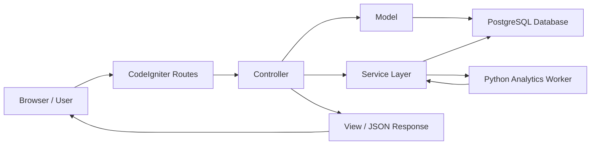
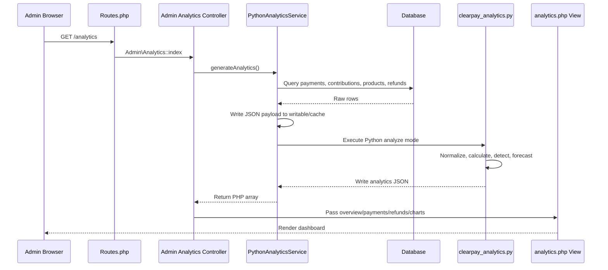
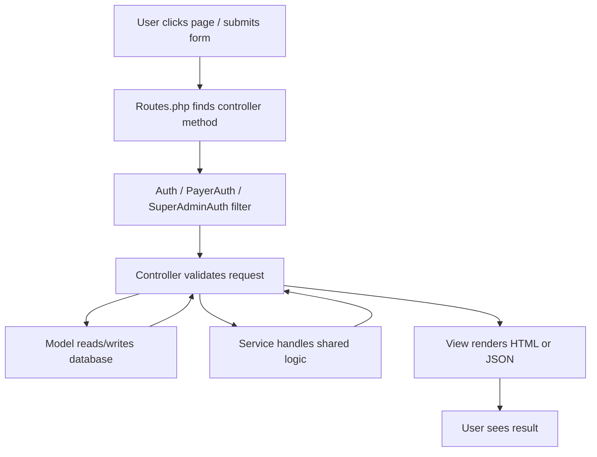
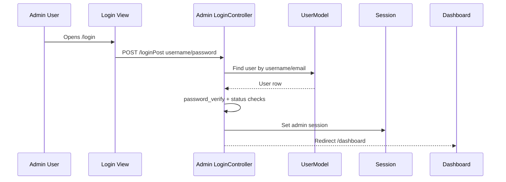
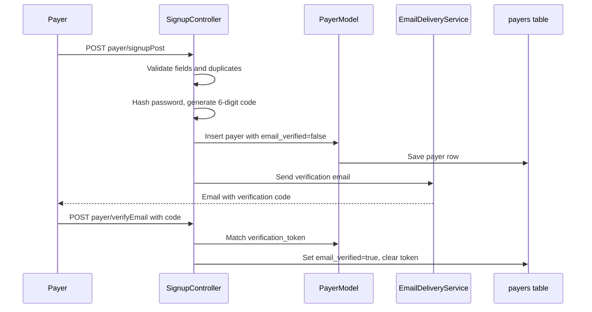
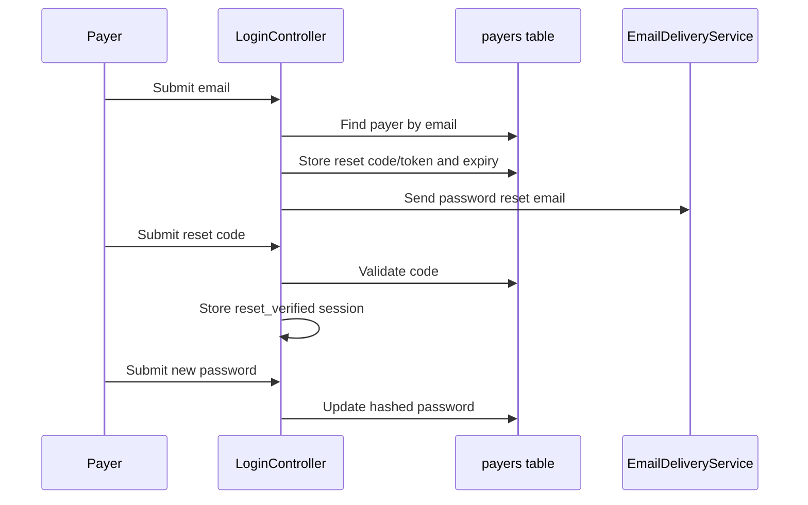
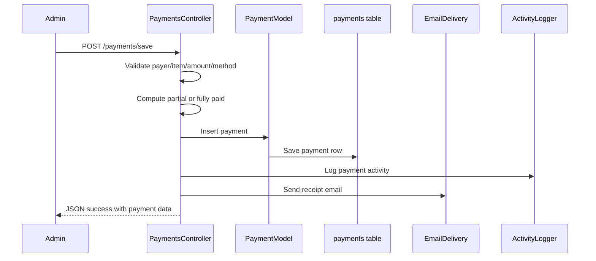
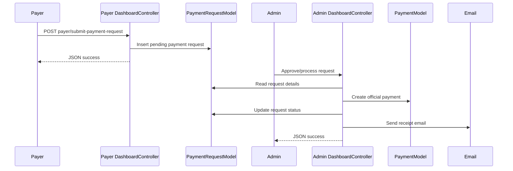
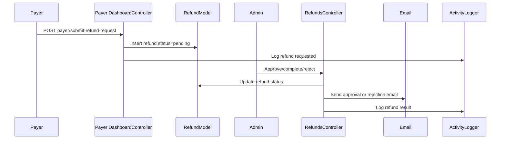
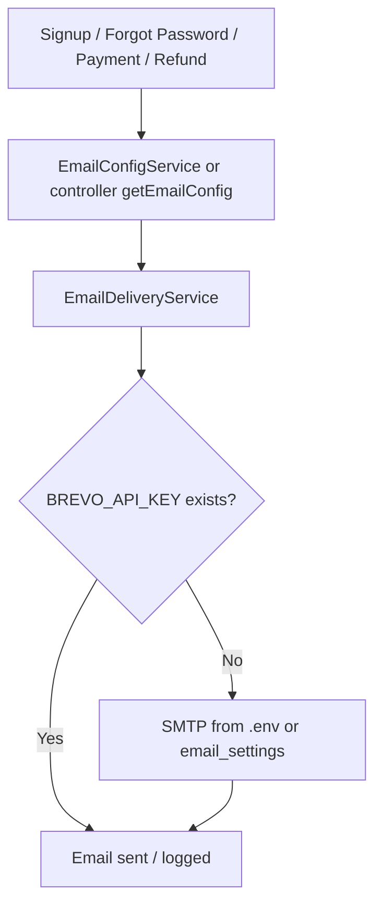

# ClearPay Python Integration And MVC Workflows

This document explains how Python is integrated into ClearPay and how the main MVC workflows connect across routes, controllers, models, services, views, JavaScript, database tables, and email/activity side effects.

It is written for defense preparation. If asked by a teacher, the short answer is:

> ClearPay is a CodeIgniter 4 MVC web application. PHP handles routing, authentication, database transactions, views, email, uploads, and user workflows. Python is integrated as an internal analytics worker. PHP exports selected database rows into a JSON payload, runs a Python script as a separate process, then reads the analytics JSON or report file generated by Python and renders it in the admin dashboard.

## 1. High-Level Architecture

ClearPay has these major layers:

| Layer | Main responsibility | Main files/folders |
| --- | --- | --- |
| Routes | Map URLs to controller methods | `app/Config/Routes.php` |
| Filters | Protect routes and apply global request behavior | `app/Config/Filters.php`, `app/Filters/*` |
| Controllers | Receive requests, validate input, coordinate models/services, return views or JSON | `app/Controllers/*` |
| Models | Represent database tables and reusable database queries | `app/Models/*` |
| Services | Shared non-controller logic such as analytics, email, activity logging, backup, storage | `app/Services/*` |
| Views | HTML/PHP templates rendered for browser pages and email templates | `app/Views/*` |
| Public assets | CSS, JavaScript, uploaded images, front controller | `public/*` |
| Database migrations/seeds | Define and seed database schema | `app/Database/Migrations/*`, `app/Database/Seeds/*` |
| Python worker | Analytics calculations and report generation | `analytics/clearpay_analytics.py` |

The web application remains PHP-based. Python is not running as a separate web server. It is not Flask, FastAPI, or a background queue. It is a command-line worker invoked by PHP when analytics are needed.



## 2. Why Python Is Integrated

Python is used only for analytics and report-processing logic that is easier to express as data-processing code.

Python handles:

- Financial summaries.
- Profit calculations.
- Revenue trends.
- Refund trend data.
- Duplicate payment detection.
- Suspicious payment flagging.
- Simple revenue forecasting.
- CSV, Excel-compatible, and fallback PDF report output.

PHP still handles:

- User login and session checks.
- Admin, payer, and super admin workflows.
- Database reads/writes for operational features.
- Rendering pages.
- Sending emails.
- File uploads.
- Payment/refund approval workflows.
- Download responses.

The reason this design is practical is that it keeps the main system in CodeIgniter while isolating analytics in one script. The app does not need a separate Python API server.

## 3. Python Integration Files

| File | Role |
| --- | --- |
| `app/Services/PythonAnalyticsService.php` | PHP bridge between CodeIgniter and Python. Builds payload, runs Python, reads output. |
| `analytics/clearpay_analytics.py` | Python worker. Normalizes payload, calculates analytics, detects duplicates/suspicious rows, writes JSON or reports. |
| `app/Controllers/Admin/Analytics.php` | Admin analytics controller. Calls the Python service for `/analytics` and exports. |
| `app/Controllers/Admin/ReviewCenterController.php` | Uses Python analytics to show duplicate/suspicious alerts in the Review Center. |
| `app/Views/admin/analytics.php` | Renders Python-generated values into cards, tables, Chart.js graphs, and audit sections. |
| `app/Views/partials/analytics_*` | Smaller reusable analytics UI fragments. |
| `app/Models/AnalyticsFindingReviewModel.php` | Stores admin-reviewed analytics findings so dismissed duplicate/suspicious alerts can be hidden per admin. |

## 4. Python Analytics Request Flow

When an admin opens the analytics page:

1. Browser requests `/analytics`.
2. `app/Config/Routes.php` maps `/analytics` to `Admin\Analytics::index`.
3. The `auth` filter requires an admin session.
4. `Analytics::index()` calls `PythonAnalyticsService::generateAnalytics()`.
5. `PythonAnalyticsService` builds a JSON payload from database tables.
6. PHP writes that payload into a temporary file under `writable/cache`.
7. PHP runs `analytics/clearpay_analytics.py analyze --input ... --output ...`.
8. Python reads the payload, calculates analytics, and writes output JSON.
9. PHP reads the JSON output and converts it to a PHP array.
10. `Analytics::index()` passes the array to `app/Views/admin/analytics.php`.
11. The view renders cards, tables, and Chart.js datasets.



## 5. PHP Bridge: `PythonAnalyticsService`

The bridge class is `app/Services/PythonAnalyticsService.php`.

Its job is not to calculate analytics directly. Its job is to prepare data, execute Python safely enough for local/demo use, and return the result to controllers.

### 5.1 Python executable selection

In the constructor, the service searches for Python in this order:

1. `PYTHON_ANALYTICS_EXECUTABLE` environment variable.
2. `analytics/.venv/Scripts/python.exe`.
3. `analytics/.venv/bin/python`.
4. PostgreSQL pgAdmin bundled Python path.
5. `python` from the system `PATH`.

Each candidate is tested by running:

```text
python --version
```

If none works, analytics fails with:

```text
Python executable not found for analytics integration.
```

Teacher explanation:

> The app does not assume one fixed Python installation. It tries common local paths and allows an environment override. This makes it more portable across machines.

### 5.2 Public methods

`generateAnalytics()`

- Calls `runWorker('analyze')`.
- Returns a PHP array decoded from Python JSON.
- Used by `/analytics` and `/review-center`.

`generateReport($format)`

- Accepts `pdf`, `csv`, or `excel`.
- Calls `runWorker('report', $format)`.
- Returns file path, filename, and MIME type.
- Used by `/admin/analytics/export/{type}`.

### 5.3 Payload creation

The private method `buildPayload()` reads database data and returns a PHP array with:

- `generated_at`
- `payments`
- `contributions`
- `refunds`

The important part is that PHP does the database querying. Python does not connect directly to PostgreSQL.

This is a deliberate design choice:

- Existing CodeIgniter database config stays centralized.
- Python does not need DB credentials.
- The analytics worker receives only the rows it needs.
- The worker is easier to test because it reads JSON input.

### 5.4 Payment payload fields

Payment rows include joined data from:

- `payments`
- `payers`
- `contributions`
- `products`

Important fields sent to Python:

- Payment ID.
- Payer database ID.
- Payer display name.
- Student/payer ID number.
- Profile picture path.
- Contribution or product ID.
- Item title.
- Item type.
- Configured item amount.
- Cost price.
- Amount paid.
- Quantity.
- Payment method.
- Payment status.
- Creation date.
- Payment date.
- Receipt number.
- Payment sequence.

The SQL uses `COALESCE(c.title, pr.title)` so both contribution payments and product payments can be treated as item payments by Python.

### 5.5 Contribution and product payload

`buildPayload()` loads:

- rows from `contributions`
- rows from `products`

Then it merges them into one `contributions` payload list:

```php
'contributions' => array_merge($contributions, $products)
```

This allows Python to calculate profit and type breakdowns across both contribution items and product items.

### 5.6 Refund payload

Refund rows include joined data from:

- `refunds`
- `contributions`
- `products`

Important fields:

- Refund ID.
- Payment ID.
- Payer ID.
- Contribution or product ID.
- Item title.
- Item type.
- Refund amount.
- Refund method.
- Refund status.
- Request type.
- Created/updated dates.

### 5.7 Temporary files

The bridge uses files because command-line processes need a reliable way to pass structured input/output.

Input:

```text
writable/cache/analytics_payload_*
```

Output:

```text
writable/cache/analytics_output_*.json
writable/cache/analytics_output_*.csv
writable/cache/analytics_output_*.xls
writable/cache/analytics_output_*.pdf
```

For JSON analytics, PHP deletes the output file after reading it.

For report exports, PHP returns the output file path so CodeIgniter can download it.

### 5.8 Python command shape

Analyze mode:

```text
"python.exe" "analytics/clearpay_analytics.py" analyze --input "payload" --output "output.json"
```

Report mode:

```text
"python.exe" "analytics/clearpay_analytics.py" report --input "payload" --output "report.csv" --format "csv"
```

## 6. Python Worker Internals

The worker is `analytics/clearpay_analytics.py`.

It intentionally uses the Python standard library only. There is no pandas, numpy, reportlab, Flask, or FastAPI requirement.

Teacher explanation:

> The worker uses only built-in Python modules so the analytics feature can run on a normal Python installation without dependency setup. This is practical for school/demo deployment.

### 6.1 Main entrypoint

The script starts at:

```python
if __name__ == "__main__":
    raise SystemExit(main())
```

`main()`:

1. Builds an argument parser.
2. Reads the subcommand.
3. Dispatches to either `analyze_command()` or `report_command()`.

Supported commands:

| Command | Purpose |
| --- | --- |
| `analyze` | Read payload JSON and write analytics JSON. |
| `report` | Read payload JSON, calculate analytics, and write PDF/CSV/Excel output. |

### 6.2 Normalization

Function:

```python
normalize_payload(payload)
```

Why normalization is needed:

- Database values often arrive as strings.
- Dates may come in different formats.
- Empty fields may be `None` or empty strings.
- Numeric values must be converted before calculations.

Helper functions:

- `parse_datetime(value)`
- `as_float(value)`
- `as_int(value)`
- `iso(dt)`

Example:

```python
normalized["amount_paid"] = as_float(row.get("amount_paid"))
normalized["payment_date_dt"] = parse_datetime(row.get("payment_date"))
```

Teacher explanation:

> PHP sends raw database rows as JSON. Python first normalizes those rows so later analytics logic can safely work with floats, integers, and datetime objects.

### 6.3 Core analytics pipeline

The main function is:

```python
analyze_payload(payload)
```

It returns the structure expected by PHP:

- `generated_at`
- `overview`
- `contributions`
- `payments`
- `refunds`
- `trends`
- `charts`
- `predictions`

The PHP views rely on these keys. That returned dictionary is the contract between Python and PHP.

### 6.4 Valid payment filtering

Python defines:

```python
VALID_PAYMENT_STATUSES = {"fully paid", "partial"}
```

Only these statuses count as valid collected revenue.

Reason:

- `fully paid` and `partial` represent real money collected.
- Other statuses should not inflate revenue.

### 6.5 Overview metrics

Python calculates:

- `total_revenue`
- `total_contributions`
- `active_contributors`
- `monthly_revenue`
- `monthly_growth`
- `total_profit`
- `avg_profit_margin`
- `total_outstanding_balance`
- `duplicate_records`
- `suspicious_records`

These appear as dashboard cards in `app/Views/admin/analytics.php`.

### 6.6 Profit analytics

Functions:

- `profit_summary(contributions)`
- `top_profitable(contributions)`
- `category_breakdown(contributions)`
- `type_breakdown(contributions)`

Profit is calculated as:

```text
profit = amount - cost_price
```

Profit margin is:

```text
(profit / amount) * 100
```

This applies to active contribution/product records.

### 6.7 Duplicate payment detection

Function:

```python
detect_duplicates(payments)
```

It uses two rules:

1. Same receipt number used more than once.
2. Same payer + item + amount + payment method + day repeated.

Why two rules?

- Duplicate receipt number catches explicit receipt reuse.
- Composite pattern catches repeated entries even if receipt is blank or different.

Example duplicate reason:

```text
Duplicate receipt number
```

or:

```text
Duplicate payer/contribution/amount/day pattern
```

Teacher explanation:

> Duplicate detection is heuristic. It does not automatically delete or reverse records. It only flags them for admin review.

### 6.8 Suspicious payment detection

Function:

```python
detect_suspicious(payments, duplicates)
```

It flags:

- Amount outliers.
- Four or more payments from the same payer in one day.
- Payments already matching duplicate patterns.
- Non-cash payments without receipt number.

Outlier logic uses an IQR-style threshold:

```text
upper_outlier = Q3 + 1.5 * IQR
```

Teacher explanation:

> Suspicious detection is not fraud detection. It is an admin assistance tool. It highlights records worth checking.

### 6.9 Trends and charts

Function:

```python
build_trends(payments, refunds)
```

It creates:

- Daily revenue for the last 30 days.
- Monthly revenue for the last 12 months.
- Daily transaction counts.
- Daily refund totals.

It also returns `charts` data formatted for Chart.js:

```json
{
  "daily_revenue": {
    "labels": ["2026-05-01"],
    "data": [1000.00]
  }
}
```

The view can pass this directly to JavaScript.

### 6.10 Forecasting

Function:

```python
build_predictions(daily_revenue_rows)
```

This uses a lightweight moving average with recent momentum.

It outputs:

- Projected next 7 days.
- Estimated next 30-day total.
- A confidence note.

Teacher explanation:

> The forecast is intentionally simple. It is for planning and demonstration, not guaranteed financial prediction.

### 6.11 Report generation

Functions:

- `write_delimited_report()`
- `write_simple_pdf()`
- `write_report()`

Supported formats:

| Format | Output |
| --- | --- |
| `csv` | Comma-separated file |
| `excel` | Tab-delimited `.xls`-compatible file |
| `pdf` | Simple dependency-free PDF |

For PDF export from the analytics controller:

- If TCPDF is available in PHP, PHP creates a nicer PDF.
- If TCPDF is unavailable, Python creates a simple fallback PDF.

## 7. Where Python Output Is Displayed

### 7.1 Analytics dashboard

File:

```text
app/Views/admin/analytics.php
```

Data sections:

- `$overview`
- `$contributions`
- `$payments`
- `$refunds`
- `$trends`
- `$charts`
- `$predictions`

Examples:

- `overview.total_revenue` becomes the Total Revenue card.
- `overview.duplicate_records` becomes the Duplicate Alerts card.
- `payments.duplicates` appears in Audit Findings.
- `charts.daily_revenue` is passed to Chart.js.
- `predictions.next_30_days_total` appears in Forecast.

### 7.2 Review Center

File:

```text
app/Controllers/Admin/ReviewCenterController.php
```

The Review Center calls:

```php
$analytics = (new PythonAnalyticsService())->generateAnalytics();
```

Then it extracts:

- `payments.duplicates`
- `payments.suspicious`

If Python fails, the Review Center catches the error and shows analytics as unavailable instead of crashing the whole page.

## 8. Analytics Export Workflow

Route:

```php
$routes->get('/admin/analytics/export/(:any)', 'Admin\Analytics::export/$1', ['filter' => 'auth']);
```

Controller method:

```php
Admin\Analytics::export($type)
```

Flow:

1. Admin clicks Export Report.
2. Browser opens `/admin/analytics/export/pdf`, `/csv`, or `/excel`.
3. Controller checks admin session.
4. Controller validates type.
5. For PDF:
   - Generates analytics.
   - Uses TCPDF if available.
   - Falls back to Python PDF if needed.
6. For CSV/Excel:
   - Calls Python report mode.
   - Downloads the file using CodeIgniter response.

## 9. MVC Pattern In ClearPay

ClearPay follows the MVC pattern used by CodeIgniter:

| MVC part | Meaning in ClearPay |
| --- | --- |
| Model | Database table access and reusable query logic. |
| View | HTML templates, modals, cards, forms, and JavaScript sections. |
| Controller | Request handling, validation, workflow coordination, response creation. |

General request flow:



## 10. Route Groups And User Roles

ClearPay has three main user areas:

### 10.1 Admin

Routes include:

- `/`
- `/login`
- `/dashboard`
- `/payments`
- `/payment-requests`
- `/refunds`
- `/contributions`
- `/products`
- `/payers`
- `/analytics`
- `/review-center`
- `/settings`

Protected by:

```text
auth
```

Filter:

```text
app/Filters/Auth.php
```

Session keys:

- `isLoggedIn`
- `user-id`
- `username`
- `email`
- `name`
- `role`

### 10.2 Payer

Routes include:

- `/payer/login`
- `/payer/signup`
- `/payer/dashboard`
- `/payer/contributions`
- `/payer/products`
- `/payer/payment-history`
- `/payer/payment-requests`
- `/payer/refund-requests`
- `/payer/announcements`
- `/payer/my-data`

Protected routes use:

```text
payerAuth
```

Filter:

```text
app/Filters/PayerAuth.php
```

Session keys:

- `payer_id`
- `payer_student_id`
- `payer_name`
- `payer_email`
- `payer_logged_in`
- `payer_last_activity`

### 10.3 Super Admin

Routes include:

- `/super-admin/login`
- `/super-admin/portal`
- `/super-admin/user-activity-history`

Protected by:

```text
superAdminAuth
```

Super admin approves, rejects, deactivates, reactivates, or deletes officers.

## 11. Admin Login Workflow

Files:

- Route: `app/Config/Routes.php`
- Controller: `app/Controllers/Admin/LoginController.php`
- Model: `app/Models/UserModel.php`
- View: `app/Views/admin/login.php`
- Filter after login: `app/Filters/Auth.php`

Flow:

1. User opens `/login`.
2. Route maps to `Admin\LoginController::index`.
3. View shows login form.
4. User submits form to `/loginPost`.
5. Controller validates username/password.
6. `UserModel` finds matching admin/officer account.
7. Password is checked with `password_verify`.
8. Controller checks email verification, role, approval status, and active state.
9. Session is set.
10. User is redirected to `/dashboard`.

Teacher explanation:

> The controller handles login logic, the model handles database lookup, and the view handles the form. After login, filters protect admin pages by checking session state.

## 12. Payer Signup And Email Verification Workflow

Files:

- Route: `payer/signup`, `payer/signupPost`, `payer/verifyEmail`
- Controller: `app/Controllers/Payer/SignupController.php`
- Model: `app/Models/PayerModel.php`
- Views: `app/Views/payer/signup.php`, `app/Views/emails/verification.php`
- Service: `app/Services/EmailDeliveryService.php`

Flow:

1. Payer opens `/payer/signup`.
2. Signup form posts to `/payer/signupPost`.
3. Controller validates input.
4. Controller checks duplicate student ID/email.
5. Password is hashed.
6. Verification code is generated.
7. `email_verified` is set to false.
8. `verification_token` stores the code.
9. Payer is inserted through `PayerModel`.
10. Controller calls `sendVerificationEmail()`.
11. `EmailDeliveryService` sends via Brevo if configured, otherwise SMTP.
12. Payer enters code.
13. Controller verifies code and sets `email_verified` to true.

Important note:

- Email is required for verification.
- Signup creates the payer first, then requires verification before normal login.

## 13. Payer Login Workflow

Files:

- Route: `payer/login`, `payer/loginPost`
- Controller: `app/Controllers/Payer/LoginController.php`
- Model: `app/Models/PayerModel.php`
- View: `app/Views/payer/login.php`
- Filter: `app/Filters/PayerAuth.php`

Flow:

1. Payer enters username/student ID and password.
2. Controller searches payer by exact `payer_id`.
3. Password is verified.
4. If payer has email but is not verified, login is blocked.
5. Payer session keys are set.
6. Payer is redirected to `/payer/dashboard`.

The `PayerAuth` filter also checks inactivity timeout. If the payer is inactive for too long, payer session keys are removed and the user is redirected to login.

## 14. Admin Dashboard Workflow

Files:

- Route: `/dashboard`
- Controller: `app/Controllers/Admin/DashboardController.php`
- Models: payment, payer, contribution, announcement, activity models
- View: `app/Views/admin/dashboard.php`

Flow:

1. Admin opens `/dashboard`.
2. `auth` filter checks admin session.
3. Controller queries totals and recent records.
4. Controller loads unread activity/notification data.
5. View renders dashboard cards, recent activity, pending requests, and summary data.

## 15. Payers Management Workflow

Files:

- Routes: `/payers`, `/payers/save`, `/payers/update/{id}`, `/payers/delete/{id}`
- Controller: `app/Controllers/Admin/SidebarController.php`, `app/Controllers/Admin/PayersController.php`
- Model: `app/Models/PayerModel.php`
- View: `app/Views/admin/payers.php`
- Modals: `app/Views/partials/modal-add-payer.php`, `modal-edit-payer.php`, `modal-view-payer-details.php`

Flow:

1. Admin opens `/payers`.
2. Controller loads payer list.
3. View displays payer table and modals.
4. Add/edit forms submit through POST routes.
5. Controller validates fields.
6. `PayerModel` inserts or updates.
7. Activity is logged.
8. JSON or redirect response updates the UI.

## 16. Contribution Workflow

Files:

- Routes: `/contributions`, `/contributions/save`, `/contributions/update/{id}`, `/contributions/delete/{id}`, `/contributions/toggle-status/{id}`
- Controller: `app/Controllers/Admin/ContributionsController.php`
- Model: `app/Models/ContributionModel.php`
- Views: `app/Views/admin/contributions.php`, `app/Views/partials/modal-contribution.php`
- Service: `app/Services/ActivityLogger.php`

Flow:

1. Admin opens contributions page.
2. Controller loads contribution categories and records.
3. Admin creates or updates contribution.
4. Controller validates title, amount, status, category, and optional image.
5. Image is stored under public uploads if provided.
6. Model saves the contribution.
7. ActivityLogger logs contribution event.
8. Payers can later see active contributions from their portal.

## 17. Product Workflow

Files:

- Routes: `/products`, `/products/save`, `/products/update/{id}`, `/products/delete/{id}`, `/products/toggle-status/{id}`
- Controller: `app/Controllers/Admin/ProductsController.php`
- Model: `app/Models/ProductModel.php`
- Views: `app/Views/admin/products.php`, `app/Views/partials/modal-product.php`

Flow:

1. Admin manages products similarly to contributions.
2. Product amount, cost, status, and image can be configured.
3. Product payments are handled through the same payment infrastructure, using `product_id` instead of `contribution_id`.

Teacher explanation:

> Contributions and products share payment behavior. The database differentiates them using `contribution_id` or `product_id`.

## 18. Manual Payment Workflow

Files:

- Routes: `/payments`, `/payments/save`, `/payments/save-with-confirmation`, `/payments/add-to-partial`
- Controller: `app/Controllers/Admin/PaymentsController.php`
- Model: `app/Models/PaymentModel.php`
- Views: `app/Views/admin/payments.php`, payment modals
- Service: `app/Services/ActivityLogger.php`
- Email: `app/Views/emails/receipt.php`

Flow:

1. Admin opens `/payments`.
2. Controller loads grouped payment data using `PaymentModel`.
3. Admin records a payment.
4. Controller validates payer, item, amount, method, and date.
5. Controller computes whether payment is partial or fully paid.
6. Controller creates a payment row.
7. Receipt/reference numbers are generated.
8. Optional QR receipt path may be created.
9. Activity is logged.
10. Receipt email is sent to payer if email exists.
11. JSON response updates the UI.

Important database table:

```text
payments
```

Important fields:

- `payer_id`
- `contribution_id`
- `product_id`
- `amount_paid`
- `payment_method`
- `payment_status`
- `remaining_balance`
- `receipt_number`
- `recorded_by`
- `payment_date`

## 19. Payment Request Workflow

This is the workflow where a payer submits a payment request, then admin approves or processes it.

Files:

- Payer routes: `payer/payment-requests`, `payer/submit-payment-request`
- Admin routes: `/payment-requests`, `/admin/approve-payment-request`, `/admin/process-payment-request`, `/admin/reject-payment-request`
- Payer controller: `app/Controllers/Payer/DashboardController.php`
- Admin controller: `app/Controllers/Admin/DashboardController.php`
- Model: `app/Models/PaymentRequestModel.php`
- Payment model: `app/Models/PaymentModel.php`
- Views: `app/Views/payer/payment-requests.php`, `app/Views/admin/payment-requests.php`
- Email templates: `emails/receipt.php`, `emails/payment_request_rejected.php`

Flow:

1. Payer opens payment requests page.
2. Payer selects contribution/product, payment method, amount, notes, and optional proof.
3. `Payer\DashboardController::submitPaymentRequest()` validates the request.
4. Uploaded proof is stored under `public/uploads/payment_proofs`.
5. `PaymentRequestModel` inserts a pending request.
6. `ActivityLogger` logs a submitted payment request for admins.
7. Admin opens `/payment-requests`.
8. Admin reviews pending request.
9. Admin can approve, process, reject, or delete.
10. Approval/processing creates an actual `payments` row.
11. Payment request status changes.
12. Receipt email is sent if the payer has an email.
13. Rejection email is sent if rejected.

Teacher explanation:

> A payment request is not yet a payment. It becomes a payment only after admin approval or processing.

## 20. Payment History Click Workflow

This is one of the clearest MVC plus JavaScript examples.

Files:

- View JavaScript: `app/Views/admin/payments.php`
- Route: `/payments/get-payment-history`
- Controller: `app/Controllers/Admin/PaymentsController.php`
- Model: `app/Models/PaymentModel.php`

Flow:

1. Admin clicks a payment group row.
2. JavaScript reads `data-payer-id`, `data-contribution-id`, and `data-payment-sequence`.
3. JavaScript sends a GET request to `/payments/get-payment-history`.
4. Route maps request to `Admin\PaymentsController::getPaymentHistory`.
5. Controller validates parameters.
6. Controller calls `PaymentModel::getPaymentsByPayerAndContribution()`.
7. Model joins payments, payers, contributions, and users.
8. Controller adds refund information.
9. Controller returns JSON.
10. JavaScript renders a modal.

This demonstrates:

- View handles user interaction.
- Controller handles request validation.
- Model handles SQL/data retrieval.
- JSON response updates part of the page without full reload.

## 21. Refund Workflow

Refunds can be admin-initiated or payer-requested.

Files:

- Admin routes: `/refunds`, `/admin/refunds/process`, `/admin/refunds/approve`, `/admin/refunds/complete`, `/admin/refunds/reject`
- Payer routes: `payer/refund-requests`, `payer/submit-refund-request`
- Admin controller: `app/Controllers/Admin/RefundsController.php`
- Payer controller: `app/Controllers/Payer/DashboardController.php`
- Model: `app/Models/RefundModel.php`
- Payment model: `app/Models/PaymentModel.php`
- Email templates: `emails/refund_approved.php`, `emails/refund_rejected.php`
- Activity service: `app/Services/ActivityLogger.php`

Payer-requested flow:

1. Payer opens refund requests page.
2. Payer selects eligible payment.
3. Payer submits refund amount, method, and reason.
4. Controller validates payment ownership and refundable amount.
5. Refund row is created with `status = pending` and `request_type = payer_requested`.
6. Activity is logged for admins.
7. Admin sees pending refund in Review Center or Refunds page.
8. Admin approves/completes or rejects.
9. Email is sent to payer.
10. Activity is logged for both admin and payer visibility.

Admin-initiated flow:

1. Admin opens Refunds.
2. Admin chooses payment/group.
3. Controller validates refund amount and method.
4. Refund row is inserted or updated.
5. Payment refund totals are recalculated.
6. Approval/completion email is sent.

Important table:

```text
refunds
```

Important statuses:

- `pending`
- `processing`
- `completed`
- `rejected`
- `cancelled`

## 22. Announcement Workflow

Files:

- Routes: `/announcements`, `/announcements/save`, `/announcements/update-status/{id}`, `/announcements/delete/{id}`
- Controller: `app/Controllers/Admin/AnnouncementsController.php`
- Model: `app/Models/AnnouncementModel.php`
- Payer view: `app/Views/payer/announcements.php`
- Admin view: `app/Views/admin/announcements.php`
- Activity service: `app/Services/ActivityLogger.php`

Flow:

1. Admin creates an announcement.
2. Controller saves it with target audience and status.
3. Published announcements appear to payers depending on target audience.
4. Activity notifications are created.

## 23. Email Workflow

Email is part of several MVC workflows but is implemented through services/templates.

Files:

- Config: `app/Config/Email.php`
- Service: `app/Services/EmailConfigService.php`
- Service: `app/Services/EmailDeliveryService.php`
- Brevo adapter: `app/Services/BrevoEmailService.php`
- Command: `app/Commands/TestEmailCommand.php`
- Templates: `app/Views/emails/*`

Delivery priority:

1. If `BREVO_API_KEY` exists, use Brevo HTTPS API.
2. Otherwise use SMTP from `.env` or active `email_settings` database row.

Email templates:

- `verification.php`
- `password_reset.php`
- `receipt.php`
- `payment_request_rejected.php`
- `refund_approved.php`
- `refund_rejected.php`
- officer approval/rejection templates

Workflows that send email:

- Payer signup verification.
- Payer password reset.
- Payment receipt after successful manual payment.
- Payment receipt after payment request approval/processing.
- Payment request rejection.
- Refund approval/completion.
- Refund rejection.
- Officer approval/rejection.

Testing command:

```text
php spark email:test recipient@example.com
```

If no recipient is supplied, it sends to the configured sender address.

## 24. Upload And Image Workflow

Files:

- Controller helpers in `BaseController`.
- `app/Controllers/ImageController.php`
- Upload folders under `public/uploads`.
- `.htaccess` under `public/uploads`.

Folders:

- `public/uploads/profile`
- `public/uploads/payment_proofs`
- `public/uploads/product_items`
- `public/uploads/contribution_items`
- `public/uploads/payment_methods`
- `public/uploads/qr_receipts`

Cloudinary is optional. If Cloudinary credentials are missing, local uploads are used.

For the demo:

> Local uploads are enough because the app is running on the laptop and exposed through ngrok.

## 25. Activity And Notification Workflow

Files:

- Service: `app/Services/ActivityLogger.php`
- Model: `app/Models/ActivityLogModel.php`
- Model: `app/Models/ActivityReadStatusModel.php`
- Model: `app/Models/AdminReadStatusModel.php`
- Admin dashboard/payer dashboard controllers.

ActivityLogger records events such as:

- Contribution created/updated.
- Payment recorded.
- Payer signed up or updated profile.
- Payment request submitted/approved/rejected.
- Refund requested/approved/rejected.
- Announcement created/published.

Each activity includes:

- `activity_type`
- `entity_type`
- `entity_id`
- `action`
- `title`
- `description`
- `user_id`
- `user_type`
- `payer_id`
- `target_audience`
- read status

Target audience examples:

- New payment request from payer: admins.
- Admin approves payment request: both.
- Refund requested by payer: admins.
- Refund completed/rejected by admin: both.

## 26. Review Center Workflow

Files:

- Route: `/review-center`
- Controller: `app/Controllers/Admin/ReviewCenterController.php`
- Models: `PaymentRequestModel`, `RefundModel`, `PayerModel`
- Service: `PythonAnalyticsService`
- View: `app/Views/admin/review-center.php`

Purpose:

The Review Center gathers items that need admin attention:

- Pending payment requests.
- Pending refund requests.
- Duplicate payment alerts from Python.
- Suspicious payment alerts from Python.
- Payer accounts missing passwords.
- Email configuration warnings.

Flow:

1. Admin opens Review Center.
2. Controller loads pending payment requests.
3. Controller loads pending refund requests.
4. Controller checks payer account issues.
5. Controller checks email health.
6. Controller calls Python analytics for duplicate/suspicious alerts.
7. View displays prioritized queues.

## 27. Analytics Finding Review Workflow

Files:

- Route: `/admin/analytics/mark-finding-reviewed`
- Controller: `Admin\Analytics::markFindingReviewed`
- Model: `AnalyticsFindingReviewModel`
- View/JS: `app/Views/admin/analytics.php`

Flow:

1. Python flags suspicious or duplicate record.
2. Admin sees it in Audit Findings.
3. Admin clicks Mark Reviewed.
4. JavaScript sends POST with `finding_type` and `payment_id`.
5. Controller validates request.
6. Model inserts reviewed finding row.
7. Next analytics page load filters out reviewed findings for that admin.

This keeps Python stateless. Python always reports raw findings; PHP applies per-admin review filtering.

## 28. Database Tables By Feature

| Feature | Main tables |
| --- | --- |
| Admin/officer users | `users`, `auth_tokens`, `remember_tokens` |
| Payers | `payers` |
| Contributions | `contributions`, `contribution_categories` |
| Products | `products` |
| Payments | `payments`, `payment_methods` |
| Payment requests | `payment_requests` |
| Refunds | `refunds`, `refund_methods` |
| Announcements | `announcements` |
| Activity logs | `activity_logs`, `activity_read_status`, `admin_read_status`, `user_activities` |
| Email settings | `email_settings` |
| Analytics review | `analytics_finding_reviews` |

## 29. Important Design Decisions

### 29.1 Python does not access the database directly

This avoids duplicating DB credentials in Python. PHP owns database access.

### 29.2 Python is process-based, not API-based

There is no separate Python server to start. PHP runs the script only when needed.

### 29.3 Analytics are computed on demand

Analytics are generated when the page/export is requested. They are not permanently stored, except for admin-reviewed finding records.

### 29.4 Email sending is non-fatal in payment/refund workflows

Payment/refund processing should not fail just because email fails. The app logs email errors but still completes the financial workflow.

### 29.5 Mobile API is disabled for the browser-only demo

For the current demo setup, `ENABLE_MOBILE_API = false` blocks `/api/payer/*` in production. The web payer/admin workflows remain available.

## 30. Common Teacher Questions And Answers

### Q1. Is this a pure PHP project or a Python project?

It is mainly a PHP CodeIgniter 4 MVC project. Python is integrated only as an analytics worker.

### Q2. Does Python connect directly to the database?

No. PHP queries the database, builds a JSON payload, and passes that file to Python. Python reads JSON and writes JSON or report files.

### Q3. Why use Python at all?

Python is good for data processing, trend calculations, anomaly heuristics, and report building. Keeping analytics in Python separates data analysis logic from normal web request logic.

### Q4. Is Python running all the time?

No. Python runs only when PHP invokes it for analytics or report export.

### Q5. What happens if Python is not installed?

`PythonAnalyticsService` cannot find a runnable Python executable and throws an error. The Review Center catches that error and shows analytics unavailable; the analytics page itself needs Python to render correctly.

### Q6. What data does Python analyze?

Payments, contributions, products, and refunds. PHP sends joined rows with payer names, item titles, amounts, costs, statuses, methods, dates, and receipt numbers.

### Q7. How does duplicate detection work?

It flags duplicate receipt numbers and repeated payer/item/amount/method/day patterns.

### Q8. How does suspicious detection work?

It flags amount outliers, high same-day payment frequency, duplicate-like records, and non-cash payments without receipt numbers.

### Q9. Is suspicious detection the same as fraud detection?

No. It is an admin review aid. It flags records for checking but does not decide fraud automatically.

### Q10. What is MVC in this project?

Routes send requests to controllers. Controllers validate and coordinate. Models read/write database tables. Views render pages or JavaScript uses JSON responses.

### Q11. Give one MVC example.

For payment history: the view JavaScript sends a request, the route maps it to `PaymentsController`, the controller validates parameters, `PaymentModel` queries the database, and the controller returns JSON for the view to display in a modal.

### Q12. How are payment request and payment different?

A payment request is submitted by a payer and starts as pending. It becomes an actual payment only when an admin approves or processes it.

### Q13. Are emails required?

For the demo, email is needed if you want signup verification, receipts, and refund notifications to be visible. The app can send through SMTP or Brevo. Current demo setup uses SMTP.

### Q14. Is Cloudinary required?

No. Cloudinary is optional remote image storage. The app falls back to local uploads, which is fine for a one-time ngrok demo.

### Q15. What is ngrok doing?

Ngrok exposes the local XAMPP app to the internet with a stable HTTPS URL for testing on multiple devices.

## 31. Defense Walkthrough Script

Use this concise explanation during the defense:

1. "ClearPay is built with CodeIgniter 4 using MVC."
2. "Routes map browser URLs to controller methods."
3. "Controllers validate requests and coordinate models/services."
4. "Models represent database tables and contain reusable queries."
5. "Views render the admin and payer interfaces."
6. "For analytics, PHP collects payment, contribution, product, and refund data."
7. "PHP writes that data as JSON and runs a Python worker."
8. "Python normalizes the data, calculates summaries, detects duplicate/suspicious records, and creates chart/report data."
9. "Python writes JSON or report files back to PHP."
10. "PHP renders the analytics dashboard or downloads the report."

## 32. Quick File Map For Defense

If asked "Where is that in code?", use this:

| Topic | File |
| --- | --- |
| Route definitions | `app/Config/Routes.php` |
| Admin analytics controller | `app/Controllers/Admin/Analytics.php` |
| Python bridge service | `app/Services/PythonAnalyticsService.php` |
| Python worker | `analytics/clearpay_analytics.py` |
| Analytics dashboard view | `app/Views/admin/analytics.php` |
| Review Center controller | `app/Controllers/Admin/ReviewCenterController.php` |
| Admin payment controller | `app/Controllers/Admin/PaymentsController.php` |
| Payment model | `app/Models/PaymentModel.php` |
| Refund controller | `app/Controllers/Admin/RefundsController.php` |
| Refund model | `app/Models/RefundModel.php` |
| Payer signup | `app/Controllers/Payer/SignupController.php` |
| Payer dashboard/payment requests/refunds | `app/Controllers/Payer/DashboardController.php` |
| Email delivery | `app/Services/EmailDeliveryService.php` |
| Activity logging | `app/Services/ActivityLogger.php` |

## 33. Summary

ClearPay is not just a set of pages. It has coordinated MVC workflows:

- Admin workflows for payers, contributions, products, payments, refunds, analytics, settings, announcements, and review queues.
- Payer workflows for signup, verification, login, dashboard, payment requests, refund requests, announcements, and profile updates.
- Super admin workflows for officer/account management.
- Shared services for email, analytics, activity logging, backup, and uploads.

Python is integrated cleanly as an internal analytics worker:

- PHP owns the web app and database.
- Python owns analytics calculations and simple report generation.
- The connection between them is JSON files and command execution.
- The UI consumes Python output through normal CodeIgniter controllers and views.

## 34. MVP Workflow Playbook With Code Pointers

This section is the practical "what happens when we demo it" guide. It focuses on the MVP features most likely to be tested or questioned:

- Login.
- Signup and email verification.
- Forgot password.
- Manual admin payment.
- Payer payment request.
- Refund request and processing.
- Analytics/Python dashboard.
- Email delivery.
- Uploads.

Each workflow lists:

- UI entry point.
- Route.
- Controller method.
- Models/services touched.
- Database tables touched.
- Expected input.
- Expected output.
- Demo notes.

## 35. MVP Workflow: Admin Login

### Purpose

Allows an admin/officer to access protected admin pages such as Dashboard, Payments, Refunds, Analytics, Payers, Products, and Settings.

### Main code connections

| Step | Code |
| --- | --- |
| Login page route | `app/Config/Routes.php`, admin routes section: `/`, `/login`, `/admin/login` |
| Login submit route | `app/Config/Routes.php`: `POST /loginPost` |
| Controller | `app/Controllers/Admin/LoginController.php:12` for `index()`, `:32` for `loginPost()` |
| Model | `app/Models/UserModel.php` |
| View | `app/Views/admin/login.php` |
| Auth filter after login | `app/Filters/Auth.php` |
| Session keys checked | `isLoggedIn`, `user-id`, `role`, `name`, `email` |

### Flow



### Example input for demo

Use a known admin account from your local database. In the workflow smoke seed, the demo account is:

```text
Username: adminsmoke
Password: Secret123!
```

Your real local database may have different admin accounts. Use whichever account exists in your current `users` table.

### Expected output

Successful login:

```text
Redirects to /dashboard
Admin sidebar and dashboard appear
Protected admin links become accessible
```

Invalid login:

```text
Returns to login page
Shows invalid username/password error
No admin session is created
```

### What to say in defense

> The login controller validates the credentials, retrieves the user through the model, verifies the hashed password, checks account status, then stores the login state in the session. The `auth` filter protects admin routes by checking that session.

## 36. MVP Workflow: Payer Signup And Email Verification

### Purpose

Allows a payer/student to create their own account and verify their email before logging in.

### Main code connections

| Step | Code |
| --- | --- |
| Signup page route | `app/Config/Routes.php`: `GET payer/signup` |
| Signup submit route | `app/Config/Routes.php`: `POST payer/signupPost` |
| Verify email route | `app/Config/Routes.php`: `POST payer/verifyEmail` |
| Resend code route | `app/Config/Routes.php`: `POST payer/resendVerificationCode` |
| Controller | `app/Controllers/Payer/SignupController.php:18`, `:28`, `:313`, `:360` |
| Model | `app/Models/PayerModel.php` |
| Email service | `app/Services/EmailDeliveryService.php` |
| Email template | `app/Views/emails/verification.php` |
| Table | `payers` |

### Flow



### Example input for demo

Use a real email address you can open during the demo.

```text
Student/Payer ID: 2026-DEMO-01
Name: Demo Student
Email: your-real-email@example.com
Contact Number: 09171234567
Course/Department: BSIT
Password: Demo12345!
Confirm Password: Demo12345!
```

### Expected signup JSON-style output

The controller returns JSON for signup:

```json
{
  "success": true,
  "message": "Account created successfully! Please verify your email.",
  "email_sent": true,
  "email": "your-real-email@example.com",
  "requires_verification": true
}
```

For demo/testing, the current controller may also include `verification_code` in the JSON response. In real production this should be removed, but it is useful for school testing.

### Expected email output

Email subject:

```text
Email Verification - ClearPay Payer Portal
```

Email content:

```text
Hello Demo Student,
Your verification code is: 123456
```

Actual code is randomly generated.

### Expected verification output

Successful verification:

```json
{
  "success": true,
  "message": "Email verified successfully. You can now log in."
}
```

Invalid verification code:

```json
{
  "success": false,
  "error": "Invalid verification code."
}
```

### Database result

After signup:

```text
payers.email_verified = 0/false
payers.verification_token = generated code
```

After verification:

```text
payers.email_verified = 1/true
payers.verification_token = null
```

### What to say in defense

> Signup is handled by the payer signup controller. It validates the input, stores a hashed password, generates a verification code, sends the code through the email service, and only allows login after `email_verified` is true.

## 37. MVP Workflow: Payer Login

### Purpose

Allows verified payers to access their dashboard, contributions, products, payment requests, payment history, refund requests, and announcements.

### Main code connections

| Step | Code |
| --- | --- |
| Login page route | `app/Config/Routes.php`: `GET payer/login` |
| Login submit route | `app/Config/Routes.php`: `POST payer/loginPost` |
| Controller | `app/Controllers/Payer/LoginController.php:17`, `:27` |
| Model | `app/Models/PayerModel.php` |
| View | `app/Views/payer/login.php` |
| Filter for protected payer pages | `app/Filters/PayerAuth.php` |

### Example input for demo

From the workflow smoke seed:

```text
Username/Payer ID: 2024-0001
Password: payer-one
```

Or use the account you created during signup after email verification.

### Expected output

Successful login:

```text
Redirects to /payer/dashboard
Payer sidebar/header appears
Session stores payer_id, payer_name, payer_email
```

Unverified email:

```text
Login is blocked
Message asks user to verify email first
```

Wrong password:

```text
Returns to login page
Shows Invalid Username or Password
```

### What to say in defense

> Payer login is separate from admin login. It uses a different controller and different session keys. The `payerAuth` filter protects payer-only pages and also enforces session timeout.

## 38. MVP Workflow: Forgot Password

### Purpose

Allows a payer to request a reset code through email, verify it, and set a new password.

### Main code connections

| Step | Code |
| --- | --- |
| Forgot page route | `app/Config/Routes.php`: `GET payer/forgotPassword` |
| Submit email route | `app/Config/Routes.php`: `POST payer/sendResetCode` |
| Verify reset code route | `app/Config/Routes.php`: `POST payer/verifyResetCode` |
| Reset password route | `app/Config/Routes.php`: `POST payer/resetPassword` |
| Controller | `app/Controllers/Payer/LoginController.php:223`, `:281`, `:469`, `:533` |
| Email sender method | `app/Controllers/Payer/LoginController.php:388` |
| Email service | `app/Services/EmailDeliveryService.php` |
| Email template | `app/Views/emails/password_reset.php` |
| Table | `payers` |

### Flow



### Example input for demo

```text
Email: lianne@example.com
Reset Code: code received by email
New Password: NewDemo123!
Confirm Password: NewDemo123!
```

For a live demo, use a payer email inbox you can access.

### Expected output

After requesting reset:

```json
{
  "success": true,
  "message": "If an account with that email exists, you will receive a password reset verification code."
}
```

After verifying code:

```json
{
  "success": true,
  "message": "Code verified successfully."
}
```

After resetting password:

```json
{
  "success": true,
  "message": "Password reset successfully."
}
```

### What to say in defense

> Forgot password uses a code-based email workflow. The system does not email the password. It emails a reset code, verifies the code, and then stores a newly hashed password.

## 39. MVP Workflow: Manual Admin Payment

### Purpose

Allows an admin to directly record a payment for a payer against a contribution or product.

### Main code connections

| Step | Code |
| --- | --- |
| Payments page route | `app/Config/Routes.php`: `GET /payments` |
| Save payment route | `app/Config/Routes.php`: `POST /payments/save` |
| Save with confirmation route | `app/Config/Routes.php`: `POST /payments/save-with-confirmation` |
| Add to partial route | `app/Config/Routes.php`: `POST /payments/add-to-partial` |
| Controller | `app/Controllers/Admin/PaymentsController.php:14`, `:151`, `:1084`, `:1889` |
| Model | `app/Models/PaymentModel.php` |
| Grouped payment helper | `app/Models/PaymentModel.php:184` |
| History helper | `app/Models/PaymentModel.php:297` |
| Receipt email method | `app/Controllers/Admin/PaymentsController.php:2527` |
| Receipt template | `app/Views/emails/receipt.php` |
| Table | `payments` |

### Flow



### Example input for demo

Use the smoke-test style values:

```text
Payer: Marco Reyes / 2024-0002
Contribution: Open Contribution
Amount Paid: 50.00
Payment Method: Cash
Payment Date: current date/time
Partial Payment: yes
Remaining Balance: 70.00
```

Raw POST shape:

```text
payer_id=2
contribution_id=3
amount_paid=50.00
payment_method=Cash
is_partial_payment=1
remaining_balance=70.00
payment_date=2026-05-07 14:00:00
```

### Expected output

Controller success response is JSON-like:

```json
{
  "success": true,
  "message": "Payment recorded successfully.",
  "payment": {
    "payer_name": "Marco Reyes",
    "payment_status": "partial",
    "amount_paid": 50.00
  }
}
```

Expected database row:

```text
payments.payer_id = 2
payments.contribution_id = 3
payments.amount_paid = 50.00
payments.payment_status = partial
payments.remaining_balance = 70.00
payments.receipt_number = generated receipt number
```

Expected email:

```text
Subject: Payment Receipt - [receipt number]
Template: app/Views/emails/receipt.php
```

### What to say in defense

> Manual payment is an admin-side workflow. The controller validates the payment, the model saves it to the `payments` table, the activity logger records it, and the email system sends a receipt if the payer has an email address.

## 40. MVP Workflow: Payer Payment Request

### Purpose

Allows a payer to submit a payment request with method, amount, notes, and optional proof. Admin reviews it before it becomes an official payment.

### Main code connections

| Step | Code |
| --- | --- |
| Payer page route | `app/Config/Routes.php`: `GET payer/payment-requests` |
| Payer submit route | `app/Config/Routes.php`: `POST payer/submit-payment-request` |
| Payer controller | `app/Controllers/Payer/DashboardController.php:1124` |
| Admin list route | `app/Config/Routes.php`: `GET /payment-requests` |
| Admin approval route | `app/Config/Routes.php`: `POST /admin/approve-payment-request` |
| Admin processing route | `app/Config/Routes.php`: `POST /admin/process-payment-request` |
| Admin rejection route | `app/Config/Routes.php`: `POST /admin/reject-payment-request` |
| Admin controller | `app/Controllers/Admin/DashboardController.php:389`, `:540`, `:644` |
| Model | `app/Models/PaymentRequestModel.php` |
| Request details helper | `app/Models/PaymentRequestModel.php:101` |
| Payer request helper | `app/Models/PaymentRequestModel.php:144` |
| Payment model after approval | `app/Models/PaymentModel.php` |
| Tables | `payment_requests`, `payments`, `activity_logs` |

### Flow



### Example payer input for demo

```text
Item Type: Contribution
Contribution: Open Contribution
Requested Amount: 30.00
Payment Method: Cash
Notes: Demo payment request
Proof of Payment: optional image
```

Raw POST shape:

```text
item_type=contribution
contribution_id=3
requested_amount=30.00
payment_method=Cash
notes=Demo payment request
```

### Expected payer output

```json
{
  "success": true,
  "message": "Payment request submitted successfully.",
  "request_id": 123
}
```

The payer is redirected back to payment request history in the UI after submission.

### Expected database result

```text
payment_requests.payer_id = current payer
payment_requests.contribution_id = 3
payment_requests.requested_amount = 30.00
payment_requests.payment_method = Cash
payment_requests.status = pending
```

### Expected admin approval output

When admin approves/processes:

```json
{
  "success": true,
  "message": "Payment request approved successfully."
}
```

or processing wording depending on button/action.

Database effect:

```text
payments row is created
payment_requests.status is approved/processed
receipt email is sent
activity_logs receives admin and payer-visible activity
```

### Expected rejection output

```json
{
  "success": true,
  "message": "Payment request rejected successfully."
}
```

Email:

```text
Subject: Payment Request Rejected - ClearPay
Template: app/Views/emails/payment_request_rejected.php
```

### What to say in defense

> Payment requests separate payer-submitted proof from official payments. A payer can request, but only an admin can turn it into a recorded payment.

## 41. MVP Workflow: Refund Request And Processing

### Purpose

Allows payers or admins to request/process refunds against completed payments.

### Main code connections

| Step | Code |
| --- | --- |
| Payer refund submit route | `app/Config/Routes.php`: `POST payer/submit-refund-request` |
| Payer controller | `app/Controllers/Payer/DashboardController.php:1733` |
| Admin refunds page route | `app/Config/Routes.php`: `GET /refunds` |
| Admin process route | `app/Config/Routes.php`: `POST /admin/refunds/process` |
| Admin approve route | `app/Config/Routes.php`: `POST /admin/refunds/approve` |
| Admin complete route | `app/Config/Routes.php`: `POST /admin/refunds/complete` |
| Admin reject route | `app/Config/Routes.php`: `POST /admin/refunds/reject` |
| Admin controller | `app/Controllers/Admin/RefundsController.php:16`, `:94`, `:769`, `:901`, `:1020` |
| Model | `app/Models/RefundModel.php` |
| Details helper | `app/Models/RefundModel.php:120` |
| Pending helper | `app/Models/RefundModel.php:166` |
| Payer helper | `app/Models/RefundModel.php:217` |
| Email templates | `app/Views/emails/refund_approved.php`, `refund_rejected.php` |
| Tables | `refunds`, `payments`, `activity_logs` |

### Flow



### Example payer refund input

Use an existing payment that belongs to the payer.

```text
Payment: receipt/payment shown in payment history
Refund Amount: 20.00
Refund Method: cash
Reason: Duplicate payment during demo
```

Raw POST shape:

```text
payment_id=1
refund_amount=20.00
refund_method=cash
refund_reason=Duplicate payment during demo
```

### Expected payer output

```json
{
  "success": true,
  "message": "Refund request submitted successfully.",
  "refund_id": 123
}
```

Database result:

```text
refunds.payment_id = selected payment
refunds.refund_amount = 20.00
refunds.refund_method = cash
refunds.status = pending
refunds.request_type = payer_requested
```

### Expected admin approval/completion output

```json
{
  "success": true,
  "message": "Refund approved successfully."
}
```

or:

```json
{
  "success": true,
  "message": "Refund completed successfully."
}
```

Expected email:

```text
Subject: Refund Approved - ClearPay
Template: app/Views/emails/refund_approved.php
```

### Expected admin rejection output

```json
{
  "success": true,
  "message": "Refund request rejected successfully."
}
```

Expected email:

```text
Subject: Refund Request Rejected - ClearPay
Template: app/Views/emails/refund_rejected.php
```

### What to say in defense

> Refunds are tracked separately from payments. The refund references the original payment, payer, item, amount, method, status, and request type. Admin action changes the refund status and triggers activity logs and emails.

## 42. MVP Workflow: Analytics And Python

### Purpose

Shows admin financial analytics, charts, duplicate alerts, suspicious alerts, refunds, and forecasts.

### Main code connections

| Step | Code |
| --- | --- |
| Analytics route | `app/Config/Routes.php`: `GET /analytics` |
| Export route | `app/Config/Routes.php`: `GET /admin/analytics/export/(:any)` |
| Controller | `app/Controllers/Admin/Analytics.php:26`, `:68`, `:428` |
| PHP bridge | `app/Services/PythonAnalyticsService.php:8`, `:36`, `:41`, `:51`, `:122` |
| Python script | `analytics/clearpay_analytics.py` |
| Python normalize | `analytics/clearpay_analytics.py:88` |
| Python duplicate detection | `analytics/clearpay_analytics.py:201` |
| Python suspicious detection | `analytics/clearpay_analytics.py:269` |
| Python trends | `analytics/clearpay_analytics.py:316` |
| Python predictions | `analytics/clearpay_analytics.py:387` |
| Python main analysis | `analytics/clearpay_analytics.py:434` |
| Python reports | `analytics/clearpay_analytics.py:803`, `:824`, `:832`, `:861` |
| View | `app/Views/admin/analytics.php` |
| Review model | `app/Models/AnalyticsFindingReviewModel.php` |

### Example Python input payload shape

PHP writes a JSON payload similar to:

```json
{
  "generated_at": "2026-05-07T14:00:00+08:00",
  "payments": [
    {
      "id": 1,
      "payer_db_id": 1,
      "payer_name": "Lianne Santos",
      "payer_id_number": "2024-0001",
      "contribution_id": 1,
      "product_id": null,
      "contribution_title": "Partial Contribution",
      "contribution_type": "contribution",
      "contribution_amount": "100.00",
      "cost_price": "0.00",
      "amount_paid": "40.00",
      "quantity": "1",
      "payment_method": "Cash",
      "payment_status": "partial",
      "created_at": "2026-05-07 14:00:00",
      "payment_date": "2026-05-07 14:00:00",
      "receipt_number": "RCPT-SMOKE-1",
      "payment_sequence": "1"
    }
  ],
  "contributions": [
    {
      "id": 1,
      "title": "Partial Contribution",
      "contribution_type": "contribution",
      "amount": "100.00",
      "cost_price": "0.00",
      "category": "General",
      "status": "active",
      "created_at": "2026-05-07 14:00:00"
    }
  ],
  "refunds": []
}
```

### Example Python output shape

Python returns JSON similar to:

```json
{
  "overview": {
    "total_revenue": 40.0,
    "total_contributions": 1,
    "active_contributors": 1,
    "monthly_revenue": 40.0,
    "monthly_growth": 0.0,
    "total_profit": 100.0,
    "avg_profit_margin": 100.0,
    "total_outstanding_balance": 60.0,
    "duplicate_records": 0,
    "suspicious_records": 0
  },
  "payments": {
    "by_status": [
      {
        "status": "partial",
        "count": 1,
        "total_amount": 40.0
      }
    ],
    "duplicates": [],
    "suspicious": []
  },
  "charts": {
    "daily_revenue": {
      "labels": ["2026-05-07"],
      "data": [40.0]
    }
  }
}
```

### Expected UI output

In `/analytics`, admin should see:

```text
Total Revenue card
Total Profit card
Active Contributors card
This Month Revenue card
Duplicate Alerts card
Suspicious Alerts card
Revenue Trends chart
Refund charts if refund data exists
Audit Findings section
Export Report dropdown
```

### Demo actions

1. Record a payment.
2. Open `/analytics`.
3. Show that Total Revenue changes.
4. Record duplicate-like payment if you want to show duplicate alert.
5. Export CSV or PDF.

### What to say in defense

> PHP gathers database data and sends it to Python as JSON. Python performs analytics and returns structured JSON. The controller passes that JSON to the view, where cards and Chart.js graphs are rendered.

## 43. MVP Workflow: Email Delivery

### Purpose

Sends verification codes, password reset codes, receipts, payment request rejection notices, and refund notices.

### Main code connections

| Step | Code |
| --- | --- |
| Email config | `app/Config/Email.php` |
| DB/email config reader | `app/Services/EmailConfigService.php` |
| Shared delivery service | `app/Services/EmailDeliveryService.php` |
| Brevo API adapter | `app/Services/BrevoEmailService.php` |
| Test command | `app/Commands/TestEmailCommand.php` |
| Setup check | `app/Commands/VerifySetup.php` |
| Templates | `app/Views/emails/*` |

### Delivery logic



### Demo test command

```text
php spark email:test your-email@example.com
```

Expected output:

```text
Test email sent to your-email@example.com
```

### Example email subjects

```text
Email Verification - ClearPay Payer Portal
Password Reset Request - ClearPay Payer Portal
Payment Receipt - RCPT-...
Payment Request Rejected - ClearPay
Refund Approved - ClearPay
Refund Request Rejected - ClearPay
```

### What to say in defense

> The workflow builds HTML using email views, then sends through a shared delivery service. If Brevo API is configured, it uses Brevo. Otherwise it falls back to SMTP. For our demo, SMTP is configured and tested.

## 44. MVP Workflow: Uploads

### Purpose

Stores profile pictures, proof-of-payment images, product images, contribution images, payment method QR codes, and receipt QR files.

### Main code connections

| Step | Code |
| --- | --- |
| Upload folders | `public/uploads/*` |
| Image serving route | `app/Config/Routes.php`: `uploads/(:segment)` and `uploads/(:segment)/(:segment)` |
| Image controller | `app/Controllers/ImageController.php` |
| Shared helpers | `app/Controllers/BaseController.php` |
| Cloudinary optional service | `app/Services/CloudinaryService.php` |

### Current demo behavior

Cloudinary is optional. If credentials are incomplete, the app uses local upload folders:

```text
public/uploads/profile
public/uploads/payment_proofs
public/uploads/product_items
public/uploads/contribution_items
public/uploads/payment_methods
public/uploads/qr_receipts
```

### Example upload result

If a payer uploads proof of payment:

```text
File is stored in public/uploads/payment_proofs
payment_requests.proof_of_payment_path stores filename/path
Admin can view proof in payment request details
```

### What to say in defense

> Uploads are stored locally for the demo. Cloudinary is supported but not required. The ImageController serves upload files with headers needed by browser/mobile clients.

## 45. MVP Demo Scenarios And Expected Results

Use these scenarios to demonstrate predictable app behavior.

### Scenario 1: Payer signup with email verification

Input:

```text
Student ID: DEMO-001
Name: Demo Payer One
Email: your-email@example.com
Contact: 09171234567
Course: BSIT
Password: Demo12345!
```

Expected result:

```text
Account created
Verification email sent
Payer cannot log in until code is verified
After verification, payer can log in
```

Code path:

```text
Routes.php -> Payer\SignupController::signupPost -> PayerModel -> EmailDeliveryService -> emails/verification.php
```

### Scenario 2: Payer forgot password

Input:

```text
Email: your-email@example.com
Reset code: code from email
New password: DemoReset123!
```

Expected result:

```text
Reset code email sent
Code verifies
Password changes
Old password no longer works
New password works
```

Code path:

```text
Routes.php -> Payer\LoginController::sendResetCode -> EmailDeliveryService -> Payer\LoginController::verifyResetCode -> resetPassword
```

### Scenario 3: Admin records payment

Input:

```text
Payer: Demo Payer One
Contribution: Open Contribution
Amount: 50.00
Method: Cash
Partial: Yes
```

Expected result:

```text
Payment saved
Status is partial if amount is less than contribution amount
Receipt number generated
Receipt email sent
Payment appears in payment history
Analytics revenue increases
```

Code path:

```text
Routes.php -> Admin\PaymentsController::save -> PaymentModel -> ActivityLogger -> receipt email
```

### Scenario 4: Payer submits payment request

Input:

```text
Payer logged in
Contribution: Open Contribution
Requested Amount: 30.00
Method: Cash
Notes: Demo payment request
```

Expected result:

```text
Payment request saved as pending
Admin sees it in Payment Requests / Review Center
Payer sees request in request history
```

Code path:

```text
Routes.php -> Payer\DashboardController::submitPaymentRequest -> PaymentRequestModel -> ActivityLogger
```

### Scenario 5: Admin approves payment request

Input:

```text
Admin opens pending request
Clicks approve/process
```

Expected result:

```text
Payment row is created
Payment request status changes
Receipt email sent to payer
Payment appears in payment history
Analytics updates
```

Code path:

```text
Routes.php -> Admin\DashboardController::approvePaymentRequest/processPaymentRequest -> PaymentRequestModel -> PaymentModel -> receipt email
```

### Scenario 6: Payer requests refund

Input:

```text
Payment ID: existing successful payment
Refund Amount: 20.00
Refund Method: cash
Reason: Demo refund request
```

Expected result:

```text
Refund request saved as pending
Admin sees pending refund
Activity notification created
```

Code path:

```text
Routes.php -> Payer\DashboardController::submitRefundRequest -> RefundModel -> ActivityLogger
```

### Scenario 7: Admin approves/completes refund

Input:

```text
Admin selects pending refund
Approves/completes it
Adds optional admin note/reference
```

Expected result:

```text
Refund status becomes completed
Refund approval email sent
Refund appears in history
Refund analytics update
```

Code path:

```text
Routes.php -> Admin\RefundsController::approveRequest/completeRefund -> RefundModel -> refund_approved email -> ActivityLogger
```

### Scenario 8: Admin opens analytics

Input:

```text
Admin opens /analytics
```

Expected result:

```text
Python worker runs
Dashboard cards load
Charts load
Duplicate/suspicious findings appear if present
Export works for PDF/CSV
```

Code path:

```text
Routes.php -> Admin\Analytics::index -> PythonAnalyticsService::generateAnalytics -> analytics/clearpay_analytics.py -> analytics.php
```

## 46. Data Contracts To Remember

### Login contract

Input:

```text
username/password or payer_id/password
```

Output:

```text
Session created + redirect
```

### JSON workflow contract

Many AJAX workflows return:

```json
{
  "success": true,
  "message": "Action completed successfully."
}
```

or:

```json
{
  "success": false,
  "message": "Validation failed."
}
```

### Python analytics contract

Input from PHP to Python:

```text
generated_at
payments[]
contributions[]
refunds[]
```

Output from Python to PHP:

```text
overview
contributions
payments
refunds
trends
charts
predictions
generated_at
```

### Email contract

Input:

```text
recipient email
subject
HTML template
optional text body
```

Output:

```text
true if sent
false if failed
error logged in writable/logs
```

## 47. Quick Defense Answers For MVP Workflows

### How does login connect?

Route to controller, controller checks model, password is verified, session is created, filters protect future pages.

### How does signup connect?

Signup controller validates and inserts payer, email service sends verification code, verify method updates `email_verified`.

### How does forgot password connect?

Login controller generates reset code, email service sends it, verify method confirms it, reset method saves a new password hash.

### How does payment connect?

Payment controller validates admin input, payment model saves row, receipt is generated, email and activity logs are triggered.

### How does payment request connect?

Payer controller creates a pending request. Admin controller later turns it into a real payment or rejects it.

### How does refund connect?

Refund controller/model records refund request and status. Admin processing changes status and sends approval/rejection email.

### How does Python connect?

PHP gathers database rows, writes JSON, runs Python with command-line arguments, Python writes output, PHP reads it and renders analytics.

### What can we demo safely?

Demo login, signup verification, forgot password, payment, payment request, refund, analytics, and email test. Use real accessible email addresses for signup/password reset/receipts.

## 48. Exact Code Workflow Appendix

This appendix maps the MVP workflows to the exact route, view, controller, model/service, session, and response code used by ClearPay. Use this section when a teacher asks, "Where is that in your code?"

### 48.1 Admin Login Exact Code

Step 1: Admin opens `/login`.

Code in `app/Config/Routes.php`:

```php
$routes->get('/', 'Admin\LoginController::index');
$routes->get('/login', 'Admin\LoginController::index');
$routes->get('/admin/login', 'Admin\LoginController::index');
$routes->post('/loginPost', 'Admin\LoginController::loginPost');
```

Step 2: `Routes.php` sends the request to `Admin\LoginController::index()`.

Code in `app/Controllers/Admin/LoginController.php`:

```php
public function index()
{
    try {
        if (session()->get('isLoggedIn')) {
            return redirect()->to('/dashboard');
        }

        return view('admin/login');
    } catch (\Exception $e) {
        log_message('error', 'LoginController index error: ' . $e->getMessage());

        return $this->response->setStatusCode(200)
            ->setBody('<!DOCTYPE html><html><head><title>ClearPay</title></head><body><h1>ClearPay</h1><p>Application is starting up. Please try again in a moment.</p></body></html>');
    }
}
```

Step 3: The login view renders the username/password form.

Code in `app/Views/admin/login.php`:

```php
<?php if (session()->getFlashdata('error')): ?>
  <div class="alert alert-danger">
    <i class="fas fa-exclamation-circle"></i>
    <?= session()->getFlashdata('error') ?>
  </div>
<?php endif; ?>

<form method="post" action="<?= base_url('loginPost') ?>" class="login-form">
  <input type="text" name="username" id="username" class="form-control" required>
  <input type="password" name="password" id="password" class="form-control" required>
  <input type="checkbox" name="remember" id="remember">
  <button type="submit" class="btn-login">Login</button>
</form>
```

Step 4: Admin submits credentials. The controller reads the same form field names.

Code in `app/Controllers/Admin/LoginController.php`:

```php
$session = session();
$userModel = new UserModel();

$username = $this->request->getPost('username');
$password = $this->request->getPost('password');
$rememberMe = $this->request->getPost('remember');
```

Step 5: The controller checks the account in the database.

Code in `app/Controllers/Admin/LoginController.php`:

```php
$user = $userModel->where('username', $username)->first();
if ($user && $user['username'] === $username && password_verify($password, $user['password'])) {
```

Step 6: The controller blocks pending/rejected officers and deactivated accounts.

Code in `app/Controllers/Admin/LoginController.php`:

```php
$status = $user['status'] ?? 'approved';
if ($user['role'] === 'officer' && $status !== 'approved') {
    if ($status === 'pending') {
        return redirect()->back()->with('error', 'Your account is pending approval from a Super Admin. Please wait for approval before logging in.');
    } elseif ($status === 'rejected') {
        return redirect()->back()->with('error', 'Your account has been rejected. Please contact the system administrator.');
    }
}

if (!$isActive) {
    return redirect()->back()->with('error', 'Your account has been deactivated. Please contact the system administrator for assistance.');
}
```

Step 7: If valid, session values are created.

Code in `app/Controllers/Admin/LoginController.php`:

```php
$userModel->update($user['id'], [
    'last_activity' => date('Y-m-d H:i:s')
]);

$session->set([
    'user-id'         => $user['id'],
    'username'        => $user['username'],
    'email'           => $user['email'],
    'name'            => $user['name'],
    'role'            => $user['role'],
    'profile_picture' => $normalizedProfilePicture,
    'isLoggedIn'      => true,
]);

$session->set('forceSidebarExpanded', true);
```

Step 8: Remember Me is optional.

Code in `app/Controllers/Admin/LoginController.php`:

```php
if ($rememberMe) {
    $this->setRememberMeToken($user['id']);
}
```

Step 9: Admin is redirected to `/dashboard`.

Code in `app/Controllers/Admin/LoginController.php`:

```php
return redirect()->to('/dashboard');
```

Step 10: If invalid, login page shows an error.

Code in `app/Controllers/Admin/LoginController.php`:

```php
return redirect()->back()->with('error', 'Invalid credentials');
```

### 48.2 Payer Signup And Email Verification Exact Code

Step 1: Payer opens `/payer/signup`.

Code in `app/Config/Routes.php`:

```php
$routes->get('payer/signup', 'Payer\SignupController::index');
$routes->post('payer/signupPost', 'Payer\SignupController::signupPost');
$routes->post('payer/verify-email', 'Payer\SignupController::verifyEmail');
```

Step 2: Signup page is rendered.

Code in `app/Controllers/Payer/SignupController.php`:

```php
public function index()
{
    return view('payer/signup');
}
```

Step 3: Signup form posts to `signupPost()`, and the controller reads form data.

Code pattern in `app/Controllers/Payer/SignupController.php`:

```php
public function signupPost()
{
    $payerModel = new PayerModel();
    $data = [
        'payer_id'      => $this->request->getPost('payer_id'),
        'payer_name'    => $this->request->getPost('payer_name'),
        'email_address' => $this->request->getPost('email_address'),
        'contact_number'=> $this->request->getPost('contact_number'),
        'password'      => password_hash($this->request->getPost('password'), PASSWORD_DEFAULT),
    ];
```

Step 4: The controller generates a verification code and inserts/saves the payer.

Exact code pattern used in `app/Controllers/Payer/SignupController.php`:

```php
$verificationCode = sprintf('%06d', random_int(0, 999999));
$data['verification_code'] = $verificationCode;
$data['is_verified'] = false;

if ($payerModel->insert($data)) {
    $emailSent = $this->sendVerificationEmail($data['email_address'], $data['payer_name'], $verificationCode);
}
```

Step 5: Verification email is sent through the shared email service.

Code in `app/Controllers/Payer/SignupController.php`:

```php
public function sendVerificationEmail($email, $name, $code)
{
    $htmlMessage = view('emails/payer_verification', [
        'name' => $name,
        'code' => $code,
    ]);

    return (new \App\Services\EmailDeliveryService())->send(
        config('Email')->toArray(),
        $email,
        'Verify your ClearPay account',
        $htmlMessage
    );
}
```

Step 6: User submits the code to `verifyEmail()`.

Code pattern in `app/Controllers/Payer/SignupController.php`:

```php
public function verifyEmail()
{
    $email = $this->request->getPost('email');
    $code = $this->request->getPost('code');
    $payerModel = new PayerModel();

    $payer = $payerModel->where('email_address', $email)
        ->where('verification_code', $code)
        ->first();

    $payerModel->update($payer['id'], [
        'is_verified' => true,
        'verification_code' => null,
    ]);
}
```

Demo input:

```text
Payer ID: 2026-0001
Name: Maria Santos
Email: maria.demo@example.com
Password: DemoPass123!
Verification code: code received by email
```

Expected output:

```text
Account is created, verification email is sent, and correct code activates the payer account.
```

### 48.3 Payer Login Exact Code

Step 1: Payer opens `/payer/login`.

Code in `app/Config/Routes.php`:

```php
$routes->get('payer/login', 'Payer\LoginController::index');
$routes->post('payer/loginPost', 'Payer\LoginController::loginPost');
```

Step 2: Payer login page is rendered.

Code pattern in `app/Controllers/Payer/LoginController.php`:

```php
public function index()
{
    if (session()->get('payer_isLoggedIn')) {
        return redirect()->to('/payer/dashboard');
    }

    return view('payer/login');
}
```

Step 3: The login form posts credentials to `payer/loginPost`.

Code pattern in `app/Views/payer/login.php`:

```php
<form method="post" action="<?= base_url('payer/loginPost') ?>">
    <input type="text" name="payer_id" required>
    <input type="password" name="password" required>
    <button type="submit">Login</button>
</form>
```

Step 4: `loginPost()` reads the submitted identifier and password.

Code pattern in `app/Controllers/Payer/LoginController.php`:

```php
public function loginPost()
{
    $payerModel = new PayerModel();
    $payerId = $this->request->getPost('payer_id');
    $password = $this->request->getPost('password');
```

Step 5: The controller checks payer ID/email and password.

Code pattern in `app/Controllers/Payer/LoginController.php`:

```php
$payer = $payerModel
    ->groupStart()
        ->where('payer_id', $payerId)
        ->orWhere('email_address', $payerId)
    ->groupEnd()
    ->first();

if ($payer && password_verify($password, $payer['password'])) {
```

Step 6: If valid, payer session is created and payer is redirected.

Code pattern in `app/Controllers/Payer/LoginController.php`:

```php
session()->set([
    'payer_id' => $payer['id'],
    'payer_student_id' => $payer['payer_id'],
    'payer_name' => $payer['payer_name'],
    'payer_email' => $payer['email_address'],
    'payer_isLoggedIn' => true,
]);

return redirect()->to('/payer/dashboard');
```

Step 7: Invalid login returns an error.

Code pattern in `app/Controllers/Payer/LoginController.php`:

```php
return redirect()->back()->with('error', 'Invalid credentials');
```

Demo input:

```text
Payer ID or Email: maria.demo@example.com
Password: DemoPass123!
```

Expected output:

```text
Successful login redirects to /payer/dashboard and creates payer session values.
```

### 48.4 Forgot Password Exact Code

Step 1: User opens forgot password route.

Code in `app/Config/Routes.php` for admin:

```php
$routes->get('/forgotPassword', 'Admin\LoginController::forgotPassword');
$routes->post('/forgotPasswordPost', 'Admin\LoginController::forgotPasswordPost');
$routes->post('/verifyResetCode', 'Admin\LoginController::verifyResetCode');
$routes->post('/resetPassword', 'Admin\LoginController::resetPassword');
```

Code in `app/Config/Routes.php` for payer:

```php
$routes->get('payer/forgotPassword', 'Payer\LoginController::forgotPassword');
$routes->post('payer/forgotPasswordPost', 'Payer\LoginController::forgotPasswordPost');
$routes->post('payer/verifyResetCode', 'Payer\LoginController::verifyResetCode');
$routes->post('payer/resetPassword', 'Payer\LoginController::resetPassword');
```

Step 2: Forgot password page is rendered.

Code in `app/Controllers/Payer/LoginController.php`:

```php
public function forgotPassword()
{
    return view('payer/forgot_password');
}
```

Step 3: `forgotPasswordPost()` reads the email and finds the payer.

Code pattern in `app/Controllers/Payer/LoginController.php`:

```php
public function forgotPasswordPost()
{
    $email = $this->request->getPost('email');
    $payerModel = new PayerModel();
    $payer = $payerModel->where('email_address', $email)->first();
```

Step 4: A reset code is generated and stored.

Code pattern in `app/Controllers/Payer/LoginController.php`:

```php
$resetCode = sprintf('%06d', random_int(0, 999999));
$payerModel->update($payer['id'], [
    'reset_code' => $resetCode,
    'reset_code_expires' => date('Y-m-d H:i:s', time() + 900),
]);
```

Step 5: Reset code email is sent.

Code in `app/Controllers/Payer/LoginController.php`:

```php
$emailSent = $this->sendPasswordResetEmail($payer['email_address'], $payer['payer_name'], $resetCode);
```

Code in `app/Controllers/Payer/LoginController.php`:

```php
private function sendPasswordResetEmail($email, $name, $code)
{
    $htmlMessage = view('emails/payer_password_reset', [
        'name' => $name,
        'code' => $code,
    ]);

    return (new \App\Services\EmailDeliveryService())->send(
        config('Email')->toArray(),
        $email,
        'ClearPay Password Reset Code',
        $htmlMessage
    );
}
```

Step 6: User submits reset code to `verifyResetCode()`.

Code pattern in `app/Controllers/Payer/LoginController.php`:

```php
public function verifyResetCode()
{
    $email = $this->request->getPost('email');
    $code = $this->request->getPost('code');
```

Step 7: If code is valid, reset permission is stored in session.

Code pattern in `app/Controllers/Payer/LoginController.php`:

```php
session()->set('payer_reset_verified_user_id', $payer['id']);
session()->set('payer_reset_verified_email', $email);
```

Step 8: New password is saved by `resetPassword()`.

Code pattern in `app/Controllers/Payer/LoginController.php`:

```php
public function resetPassword()
{
    $session = session();
    $userId = $session->get('payer_reset_verified_user_id');
    $newPassword = $this->request->getPost('password');

    $payerModel->update($userId, [
        'password' => password_hash($newPassword, PASSWORD_DEFAULT),
        'reset_code' => null,
        'reset_code_expires' => null,
    ]);
}
```

Demo input:

```text
Email: maria.demo@example.com
Reset Code: code from email
New Password: NewDemoPass123!
```

Expected output:

```text
Password hash is updated and the payer can log in with the new password.
```

### 48.5 Manual Admin Payment Exact Code

Step 1: Admin opens `/payments`.

Code in `app/Config/Routes.php`:

```php
$routes->get('/payments', 'Admin\PaymentsController::index', ['filter' => 'auth']);
$routes->post('/payments/save', 'Admin\PaymentsController::save', ['filter' => 'auth']);
$routes->post('/payments/save-with-confirmation', 'Admin\PaymentsController::saveWithConfirmation', ['filter' => 'auth']);
$routes->post('/payments/add-to-partial', 'Admin\PaymentsController::addToPartial', ['filter' => 'auth']);
```

Step 2: Auth filter protects the route.

Code in `app/Filters/Auth.php`:

```php
if (!session()->get('isLoggedIn')) {
    return redirect()->to('/');
}
```

Step 3: `PaymentsController::index()` loads payment data.

Code locations:

```text
app/Controllers/Admin/PaymentsController.php:14 public function index()
app/Models/PaymentModel.php:184 getGroupedPayments()
app/Models/PaymentModel.php:297 getPaymentsByPayerAndContribution()
app/Models/PaymentMethodModel.php:73 getActiveMethods()
```

Step 4: Admin submits manual payment to `save()` or `saveWithConfirmation()`.

Code locations:

```text
app/Controllers/Admin/PaymentsController.php:151 public function save()
app/Controllers/Admin/PaymentsController.php:1889 public function saveWithConfirmation()
```

Step 5: Controller reads posted payment fields.

Code pattern in `app/Controllers/Admin/PaymentsController.php`:

```php
$payerId = $this->request->getPost('payer_id');
$contributionId = $this->request->getPost('contribution_id');
$productId = $this->request->getPost('product_id');
$amountPaid = (float) $this->request->getPost('amount_paid');
$paymentMethod = $this->request->getPost('payment_method');
$receiptNumber = $this->request->getPost('receipt_number');
```

Step 6: Controller creates payment data and inserts through `PaymentModel`.

Code pattern in `app/Controllers/Admin/PaymentsController.php`:

```php
$paymentData = [
    'payer_id' => $payerId,
    'contribution_id' => $contributionId ?: null,
    'product_id' => $productId ?: null,
    'amount_paid' => $amountPaid,
    'payment_method' => $paymentMethod,
    'receipt_number' => $receiptNumber,
    'status' => $paymentStatus,
    'payment_date' => date('Y-m-d H:i:s'),
];

$paymentModel->insert($paymentData);
```

Step 7: Receipt email is sent when payer email exists.

Code in `app/Controllers/Admin/PaymentsController.php`:

```php
$emailSent = $this->sendReceiptEmail($paymentData);
```

Code location:

```text
app/Controllers/Admin/PaymentsController.php:2527 private function sendReceiptEmail($paymentData)
```

Demo input:

```text
Payer: Maria Santos
Item: Class Fund
Amount Paid: 500.00
Payment Method: Cash
Receipt Number: OR-DEMO-001
```

Expected output:

```text
Payment row is inserted, status becomes fully paid or partial, dashboard totals update, receipt email is sent.
```

### 48.6 Payer Payment Request Exact Code

Step 1: Payer submits a payment request from dashboard.

Code in `app/Config/Routes.php`:

```php
$routes->group('payer', ['filter' => 'payerAuth'], function($routes) {
    $routes->get('payment-requests', 'Payer\DashboardController::paymentRequests');
    $routes->get('payment-requests/count', 'Payer\DashboardController::getPaymentRequestsCount');
    $routes->post('submit-payment-request', 'Payer\DashboardController::submitPaymentRequest');
});
```

Step 2: Controller method receives request.

Code location:

```text
app/Controllers/Payer/DashboardController.php:1124 public function submitPaymentRequest()
```

Step 3: Controller reads payer identity from session for web requests.

Code pattern in `app/Controllers/Payer/DashboardController.php`:

```php
$payerId = session()->get('payer_id');
```

Step 4: Controller reads payment request fields.

Code pattern in `app/Controllers/Payer/DashboardController.php`:

```php
$contributionId = $this->request->getPost('contribution_id');
$productId = $this->request->getPost('product_id');
$amount = $this->request->getPost('amount');
$paymentMethod = $this->request->getPost('payment_method');
$referenceNumber = $this->request->getPost('reference_number');
$proofFile = $this->request->getFile('proof_of_payment');
```

Step 5: Controller inserts a pending request.

Code pattern in `app/Controllers/Payer/DashboardController.php`:

```php
$requestData = [
    'payer_id' => $payerId,
    'contribution_id' => $contributionId ?: null,
    'product_id' => $productId ?: null,
    'amount' => $amount,
    'payment_method' => $paymentMethod,
    'reference_number' => $referenceNumber,
    'proof_of_payment' => $proofPath,
    'status' => 'pending',
];

$paymentRequestModel->insert($requestData);
```

Step 6: Admin sees and handles requests.

Code in `app/Config/Routes.php`:

```php
$routes->get('/payment-requests', 'Admin\DashboardController::paymentRequests', ['filter' => 'auth']);
$routes->post('/admin/approve-payment-request', 'Admin\DashboardController::approvePaymentRequest', ['filter' => 'auth']);
$routes->post('/admin/reject-payment-request', 'Admin\DashboardController::rejectPaymentRequest', ['filter' => 'auth']);
$routes->post('/admin/process-payment-request', 'Admin\DashboardController::processPaymentRequest', ['filter' => 'auth']);
```

Step 7: Admin approval/process code creates the real payment.

Code locations:

```text
app/Controllers/Admin/DashboardController.php:389 approvePaymentRequest()
app/Controllers/Admin/DashboardController.php:644 processPaymentRequest()
```

Code pattern in `app/Controllers/Admin/DashboardController.php`:

```php
$paymentRecord = [
    'payer_id' => $request['payer_id'],
    'contribution_id' => $request['contribution_id'],
    'product_id' => $request['product_id'],
    'amount_paid' => $request['amount'],
    'payment_method' => $request['payment_method'],
    'receipt_number' => $request['reference_number'],
    'status' => $paymentStatus,
    'payment_date' => date('Y-m-d H:i:s'),
];

$paymentModel->insert($paymentRecord);
```

Step 8: Receipt or rejection email is sent.

Code locations:

```text
app/Controllers/Admin/DashboardController.php:1129 private function sendReceiptEmail($paymentData)
app/Controllers/Admin/DashboardController.php:1287 private function sendPaymentRequestRejectionEmail($requestDetails)
```

Demo input:

```text
Amount: 500.00
Method: GCash
Reference Number: GCASH-DEMO-123
Proof Image: sample screenshot/photo
```

Expected output:

```text
Pending request appears for admin. Approval creates a payment row and sends receipt email. Rejection sends rejection email.
```

### 48.7 Refund Request And Processing Exact Code

Step 1: Payer submits refund request.

Code in `app/Config/Routes.php`:

```php
$routes->group('payer', ['filter' => 'payerAuth'], function($routes) {
    $routes->get('refund-requests', 'Payer\DashboardController::refundRequests');
    $routes->get('refund-requests/count', 'Payer\DashboardController::getRefundRequestsCount');
    $routes->get('refund-methods', 'Payer\DashboardController::getActiveRefundMethods');
    $routes->get('refund-details', 'Payer\DashboardController::getRefundDetails');
    $routes->post('submit-refund-request', 'Payer\DashboardController::submitRefundRequest');
});
```

Step 2: Controller receives the refund request.

Code location:

```text
app/Controllers/Payer/DashboardController.php:1733 public function submitRefundRequest()
```

Step 3: Controller reads payer session and refund fields.

Code pattern in `app/Controllers/Payer/DashboardController.php`:

```php
$payerId = session()->get('payer_id');
$paymentId = $this->request->getPost('payment_id');
$refundAmount = $this->request->getPost('refund_amount');
$refundMethod = $this->request->getPost('refund_method');
$reason = $this->request->getPost('reason');
```

Step 4: Controller inserts pending refund.

Code pattern in `app/Controllers/Payer/DashboardController.php`:

```php
$refundData = [
    'payment_id' => $paymentId,
    'payer_id' => $payerId,
    'refund_amount' => $refundAmount,
    'refund_method' => $refundMethod,
    'reason' => $reason,
    'status' => 'pending',
    'request_type' => 'payer_request',
];

$refundModel->insert($refundData);
```

Step 5: Admin opens refund management.

Code in `app/Config/Routes.php`:

```php
$routes->get('/refunds', 'Admin\RefundsController::index', ['filter' => 'auth']);
$routes->post('/admin/refunds/process', 'Admin\RefundsController::processRefund', ['filter' => 'auth']);
$routes->post('/admin/refunds/approve', 'Admin\RefundsController::approveRequest', ['filter' => 'auth']);
$routes->post('/admin/refunds/complete', 'Admin\RefundsController::completeRefund', ['filter' => 'auth']);
$routes->post('/admin/refunds/reject', 'Admin\RefundsController::rejectRequest', ['filter' => 'auth']);
```

Step 6: Admin approves, completes, or rejects refund.

Code locations:

```text
app/Controllers/Admin/RefundsController.php:769 public function approveRequest()
app/Controllers/Admin/RefundsController.php:901 public function completeRefund()
app/Controllers/Admin/RefundsController.php:1020 public function rejectRequest()
```

Code patterns in `app/Controllers/Admin/RefundsController.php`:

```php
$refundModel->update($refundId, [
    'status' => 'approved',
    'processed_by' => session()->get('user-id'),
    'processed_at' => date('Y-m-d H:i:s'),
]);
```

```php
$refundModel->update($refundId, [
    'status' => 'completed',
    'completed_at' => date('Y-m-d H:i:s'),
]);
```

```php
$refundModel->update($refundId, [
    'status' => 'rejected',
    'rejection_reason' => $reason,
    'processed_by' => session()->get('user-id'),
    'processed_at' => date('Y-m-d H:i:s'),
]);
```

Step 7: Refund email notification is sent.

Code locations:

```text
app/Controllers/Admin/RefundsController.php:1246 sendRefundApprovalEmail()
app/Controllers/Admin/RefundsController.php:1393 sendRefundRejectionEmail()
```

Demo input:

```text
Payment: OR-DEMO-001
Refund Amount: 500.00
Refund Method: GCash
Reason: Duplicate payment during demo
```

Expected output:

```text
Refund request appears as pending, admin approves/completes or rejects it, and payer receives email notification.
```

### 48.8 Email Delivery Exact Code

Step 1: Workflow controllers call email helper/service methods.

Signup example:

```php
$emailSent = $this->sendVerificationEmail($data['email_address'], $data['payer_name'], $verificationCode);
```

Forgot password example:

```php
$emailSent = $this->sendPasswordResetEmail($payer['email_address'], $payer['payer_name'], $resetCode);
```

Payment receipt example:

```php
$emailSent = $this->sendReceiptEmail($paymentData);
```

Refund examples:

```php
$this->sendRefundApprovalEmail($refundDetails);
$this->sendRefundRejectionEmail($refundDetails);
```

Step 2: `EmailDeliveryService` chooses Brevo or SMTP.

Code in `app/Services/EmailDeliveryService.php`:

```php
public function send(array $emailConfig, string $to, string $subject, string $htmlMessage, ?string $textMessage = null): bool
{
    $brevoApiKey = (string) env('BREVO_API_KEY', '');

    if ($brevoApiKey !== '') {
        try {
            $brevoService = new BrevoEmailService($brevoApiKey);
            $result = $brevoService->send($to, $subject, $htmlMessage, $textMessage);

            if (($result['success'] ?? false) === true) {
                return true;
            }
        } catch (\Throwable $e) {
            log_message('error', 'Brevo email failed, falling back to SMTP: ' . $e->getMessage());
        }
    }

    return $this->sendViaSmtp($emailConfig, $to, $subject, $htmlMessage);
}
```

Step 3: SMTP sends when Brevo is not configured.

Code in `app/Services/EmailDeliveryService.php`:

```php
$emailService = \Config\Services::email();
$emailService->initialize($emailConfig);
$emailService->setFrom($emailConfig['fromEmail'], $emailConfig['fromName']);
$emailService->setTo($to);
$emailService->setSubject($subject);
$emailService->setMessage($htmlMessage);

if ($emailService->send()) {
    return true;
}
```

Demo command:

```bash
php spark email:test
```

Expected output:

```text
Test email sent to configured recipient.
```

### 48.9 Python Analytics Exact Code

Step 1: Admin opens analytics route.

Code in `app/Config/Routes.php`:

```php
$routes->get('/analytics', 'Admin\Analytics::index', ['filter' => 'auth']);
$routes->post('/admin/analytics/mark-finding-reviewed', 'Admin\Analytics::markFindingReviewed', ['filter' => 'auth']);
$routes->get('/admin/analytics/export/(:any)', 'Admin\Analytics::export/$1', ['filter' => 'auth']);
```

Step 2: Controller calls Python service.

Code location:

```text
app/Controllers/Admin/Analytics.php:26 public function index()
```

Code pattern:

```php
$analytics = (new PythonAnalyticsService())->generateAnalytics();
```

Step 3: PHP service runs Python worker.

Code in `app/Services/PythonAnalyticsService.php`:

```php
public function generateAnalytics(): array
{
    return $this->runWorker('analyze');
}

public function generateReport(string $format): array
{
    return $this->runWorker('report', $format);
}
```

Step 4: PHP builds database payload for Python.

Code location:

```text
app/Services/PythonAnalyticsService.php:122 buildPayload()
```

Important output shape:

```php
return [
    'generated_at' => date(DATE_ATOM),
    'payments' => $payments,
    'contributions' => array_merge($contributions, $products),
    'refunds' => $refunds,
];
```

Step 5: Python normalizes and analyzes payload.

Code in `analytics/clearpay_analytics.py`:

```python
def analyze_payload(payload):
    normalized = normalize_payload(payload)
    duplicates = detect_duplicates(normalized["payments"])
    suspicious = detect_suspicious(normalized["payments"], duplicates)
    trends = build_trends(normalized["payments"], normalized["refunds"])
    predictions = build_predictions(trends["daily_revenue_rows"])
```

Step 6: Python writes JSON/report output and PHP displays it.

Code locations:

```text
analytics/clearpay_analytics.py:824 analyze_command()
analytics/clearpay_analytics.py:832 report_command()
app/Views/admin/analytics.php displays overview, charts, duplicates, suspicious records, and predictions.
```

Expected output:

```text
Analytics page displays total revenue, profit, daily/monthly trends, duplicate alerts, suspicious alerts, and forecast cards.
```

## 49. Defense Recommendations: How To Avoid Trouble During Code Questions

Prepare around workflows, not isolated files. If an instructor points to any part of the code, answer by tracing the request path:

```text
Route -> Controller -> Model/Service -> Database/View/Email/JSON Response
```

That structure works for almost every feature in ClearPay.

### 49.1 Main Defense Strategy

Use this answer pattern when asked about any feature:

```text
The route is defined in app/Config/Routes.php.
It calls a controller method.
The controller reads request data and validates it.
The controller uses a model to read or write the database.
If the workflow needs shared logic, it calls a service like email or Python analytics.
Then it returns a view, redirect, JSON response, or downloadable file.
```

This keeps the answer organized and prevents getting stuck on one code line.

### 49.2 Files To Keep Open During Defense

Keep these files open in tabs so the group can quickly point to the code:

| Area | File |
| --- | --- |
| Routes | `app/Config/Routes.php` |
| Admin login, admin forgot password | `app/Controllers/Admin/LoginController.php` |
| Payer login, payer forgot password | `app/Controllers/Payer/LoginController.php` |
| Payer signup and email verification | `app/Controllers/Payer/SignupController.php` |
| Payer dashboard, payment request, refund request | `app/Controllers/Payer/DashboardController.php` |
| Manual payments | `app/Controllers/Admin/PaymentsController.php` |
| Payment request admin approval/rejection | `app/Controllers/Admin/DashboardController.php` |
| Refund admin approval/completion/rejection | `app/Controllers/Admin/RefundsController.php` |
| Python bridge | `app/Services/PythonAnalyticsService.php` |
| Python worker | `analytics/clearpay_analytics.py` |
| Shared email sending | `app/Services/EmailDeliveryService.php` |
| Admin auth guard | `app/Filters/Auth.php` |

### 49.3 Suggested Group Member Assignments

If multiple group members will answer questions, assign ownership by workflow:

| Member | Recommended topic |
| --- | --- |
| Member 1 | Login, signup, forgot password |
| Member 2 | Manual payments and payment requests |
| Member 3 | Refund requests and admin refund processing |
| Member 4 | Python analytics and reports |
| Member 5 | Email, uploads, routes, and demo setup |

Each member should be able to explain the route, controller, model/service, database effect, and expected output for their topic.

### 49.4 Short Answers To Memorize

**Where do URLs connect?**

`app/Config/Routes.php`.

**Where is business logic?**

Controllers coordinate the workflow, models query the database, and services handle shared logic.

**Where is admin login stored?**

In session values such as `isLoggedIn`, `user-id`, `username`, `email`, `name`, and `role`.

**Where is payer login stored?**

In payer session values such as `payer_isLoggedIn`, `payer_id`, `payer_name`, and `payer_email`.

**Where is password security handled?**

Passwords are saved with `password_hash()` and checked with `password_verify()`.

**Where does email happen?**

Workflow controllers call email helper methods. Those methods use `EmailDeliveryService`, which sends through Brevo if configured or SMTP for the demo.

**Where does Python connect?**

`PythonAnalyticsService` builds a JSON payload, runs `analytics/clearpay_analytics.py`, reads the JSON output, and passes it to the analytics view.

**Does Python directly access the database?**

No. PHP queries the database and sends selected rows to Python as JSON.

**Is Brevo required?**

No for the school demo. SMTP is enough if `php spark email:test` succeeds.

**Is Cloudinary required?**

No for the school demo. Local uploads are enough when the app is served from the demo machine through ngrok.

**Is the Flutter/mobile app required?**

No for this demo. The browser-based web app is the MVP being demonstrated.

### 49.5 Best Way To Explain MVC

Use this exact answer:

```text
ClearPay follows MVC because routes send requests to controllers, controllers coordinate the workflow, models handle database access, and views render the HTML. Services are used for shared logic like email and Python analytics so the controllers do not need to duplicate that code.
```

Example:

```text
For admin login, Routes.php maps /login to Admin\LoginController::index().
The view app/Views/admin/login.php displays the form.
The form submits to /loginPost.
LoginController::loginPost() reads username and password, uses UserModel to find the user, verifies the password with password_verify(), creates session values, and redirects to /dashboard.
```

### 49.6 Best Way To Explain Python

Use this exact answer:

```text
Python is only an internal analytics worker. PHP remains the main web application. PHP gathers database rows, writes a JSON payload, runs Python as a command-line script, then reads the JSON result and displays it in the admin analytics dashboard.
```

If asked why Python is used:

```text
Python is better suited for data-processing logic like trends, duplicate detection, suspicious payment detection, and simple forecasting. Keeping it as a command-line worker avoids needing another web server like Flask or FastAPI.
```

If asked what happens if Python is unavailable:

```text
Normal app workflows still work because login, signup, payments, refunds, and email are PHP workflows. Only analytics/report generation would be affected.
```

### 49.7 Best Way To Explain Email

Use this exact answer:

```text
Email is centralized through EmailDeliveryService. Signup verification, forgot password, payment receipts, payment request updates, and refund updates call their own controller helper methods, and those helper methods use EmailDeliveryService. For our demo, SMTP is enough. Brevo is optional.
```

Demo proof:

```bash
php spark email:test
```

Expected result:

```text
Test email sent to configured recipient.
```

### 49.8 Best Way To Explain Payments

Use this exact answer:

```text
Manual payments are admin-created payment records. The /payments route opens PaymentsController. The controller validates payer, item, amount, method, and receipt data, then saves a row using PaymentModel. After saving, the payer balance/history and admin dashboard reflect the payment, and the app can send a receipt email.
```

For payer payment requests:

```text
A payer payment request is not immediately treated as a real payment. The payer submits a pending request from the payer dashboard. Admin reviews it from payment requests. If approved or processed, Admin\DashboardController creates the real payment row. If rejected, the request is marked rejected and an email can be sent.
```

### 49.9 Best Way To Explain Refunds

Use this exact answer:

```text
Refunds have a request and processing workflow. The payer can submit a refund request from the payer dashboard. The refund is saved as pending. Admin opens the refunds page and can approve, complete, or reject it. The RefundModel stores the status changes, and the controller sends an approval/completion/rejection email when possible.
```

### 49.10 Demo Scope Honesty

Be clear about the project scope:

```text
This app is demo-ready for a school MVP defense. It supports browser-based admin and payer workflows, email notifications, local uploads, ngrok multi-device access, and Python analytics. It is not being presented as a fully hardened production banking system.
```

If asked about production improvements, mention:

- Re-enable CSRF protection for production web routes.
- Keep mobile API disabled unless proper token/session validation is implemented.
- Restrict trusted proxy IPs for production hosting.
- Use persistent cloud storage such as Cloudinary only when deploying to a real cloud environment.
- Use a production-grade email provider such as Brevo only when long-term deliverability matters.

### 49.11 Most Likely Instructor Questions

Expect questions about:

- Why MVC?
- How login sessions work.
- How passwords are hashed and verified.
- How signup verification works.
- How forgot password reset codes work.
- How payment requests become actual payments.
- How refunds change status.
- How emails are sent.
- Why Python is used.
- Whether Python directly accesses the database.
- What happens if Python, email, or uploads fail.
- How multiple devices access the demo through ngrok.

### 49.12 If You Get Stuck

Use this fallback answer:

```text
Let me trace the workflow from the route. First, I will check Routes.php for the URL. Then I will open the controller method. From there, I can identify which model or service it uses and what response it returns.
```

This is a good answer because it shows that you understand how to navigate the project even if you do not remember every line.
